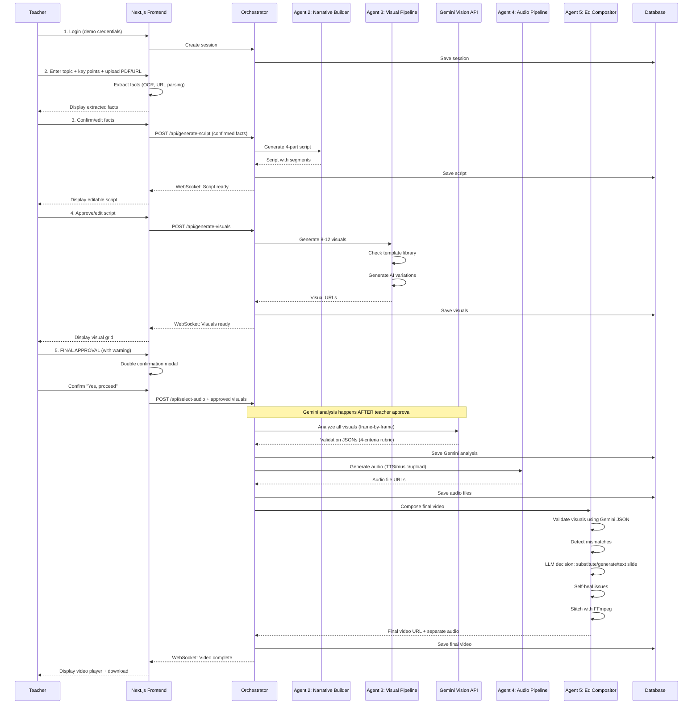

# User Journey & UI Specifications

**Document:** 02 - User Journey & UI Specifications
**Version:** 3.0
**Last Updated:** January 15, 2025

---

## Table of Contents

1. [Complete User Flow](#1-complete-user-flow)
2. [Screen-by-Screen Breakdown](#2-screen-by-screen-breakdown)
3. [Interaction Patterns](#3-interaction-patterns)

---

## 1. Complete User Flow

### 1.1 Sequence Diagram



---

## 2. Screen-by-Screen Breakdown

### Screen 1: Login

**UI Elements:**

- Simple centered card with:
  - "Educational Video Generator" heading
  - Subheading: "Create 60-second science videos for middle school students"
  - Email input (pre-filled: `demo@example.com`)
  - Password input (pre-filled: `demo123`)
  - "Start Creating" button
- **Action:** Creates session in database, redirects to topic input

**Sample UI (Text):**

```
╔══════════════════════════════════════╗
║   Educational Video Generator         ║
║   Create science videos in 60 seconds ║
║                                        ║
║   Email: [demo@example.com          ] ║
║   Password: [••••••••               ] ║
║                                        ║
║   [      Start Creating       ]        ║
╚══════════════════════════════════════╝
```

---

### Screen 2: Topic Input & Fact Extraction

**UI Elements:**

**Header:** "Step 1: Tell Us What You Want to Teach"

**Main Form:**

- **Topic Input:**
  - Label: "What topic are you teaching?"
  - Input field with placeholder: "e.g., Photosynthesis, Cell Structure, Food Chains"
  - Character limit: 100

- **Learning Objective:**
  - Label: "What should students learn?"
  - Textarea with placeholder: "e.g., Explain how plants make food from sunlight"
  - Character limit: 200

- **Key Points:**
  - Label: "Key concepts to include (comma-separated)"
  - Input field with placeholder: "e.g., chlorophyll, sunlight, glucose, oxygen"
  - Character limit: 300

**Optional Reference Materials (Collapsible Section):**

- **Upload File:**
  - "Upload notes or textbook page (PDF, JPG, PNG)"
  - Drag-and-drop area
  - Max file size: 10MB

- **OR Paste URL:**
  - "Link to educational resource"
  - Input field with placeholder: "https://..."
  - Supported: Khan Academy, educational sites, PDFs

**Action Button:** "Extract Key Facts" (processes files/URLs client-side)

**Processing State (Next.js):**

- Shows spinner: "Extracting facts from your materials..."
- Progress steps:
  - "Reading PDF..." (if uploaded)
  - "Fetching URL content..." (if provided)
  - "Identifying key concepts..."
  - "Organizing facts..."

**Extracted Facts Display:**

- Card showing:
  - **Detected Concepts:** List of key terms (editable chips)
  - **Definitions Found:** Key definitions from materials
  - **Suggested Structure:** Recommended flow based on content

- **Edit Controls:**
  - Can add/remove concepts
  - Can edit definitions
  - Can reorder structure

**Footer:**

- "Facts Ready: 8 concepts identified"
- "Continue to Script Generation" button (disabled until facts confirmed)

---

### Screen 3: Script Generation & Review

**UI Elements:**

**Header:** "Step 2: Review Your Educational Script"

**Script Preview (4-Part Structure):**

**Segment 1: Hook (0-10 seconds)**

- Duration badge: "10s"
- Narration text (editable textarea):
  ```
  "Have you ever wondered how plants make their own food? Let's discover the amazing process of photosynthesis!"
  ```
- Visual guidance preview: "Animated question mark with plant growing time-lapse"
- Edit controls: Pencil icon to edit narration

**Segment 2: Concept Introduction (10-25 seconds)**

- Duration badge: "15s"
- Narration text (editable):
  ```
  "Plants use a process called photosynthesis. Inside their leaves are tiny structures called chloroplasts that contain chlorophyll - the green pigment that captures sunlight."
  ```
- Visual guidance: "Diagram of leaf → zoom to chloroplast → highlight chlorophyll"
- Key concepts highlighted: `chloroplasts`, `chlorophyll`

**Segment 3: Process Explanation (25-45 seconds)**

- Duration badge: "20s"
- Narration text (editable):
  ```
  "When sunlight hits the chlorophyll, it triggers a chemical reaction. The plant takes in carbon dioxide from the air and water from the soil, and converts them into glucose - that's sugar, the plant's food! The chemical equation is: 6CO₂ + 6H₂O + light energy → C₆H₁₂O₆ + 6O₂"
  ```
- Visual guidance: "Animated diagram showing CO₂ + H₂O → glucose + O₂ with arrows"

**Segment 4: Conclusion (45-60 seconds)**

- Duration badge: "15s"
- Narration text (editable):
  ```
  "As a bonus, plants release oxygen as a byproduct. That's the air we breathe! So next time you see a green plant, remember - it's a tiny food factory powered by the sun."
  ```
- Visual guidance: "Real-world footage of child near tree, text overlay with key takeaway"

**Right Sidebar:**

- **Total Duration:** 60 seconds
- **Reading Level:** Grade 6-7 (auto-calculated)
- **Key Terms:** 6 concepts
- **Cost Estimate:** $0.02 (script generation)

**Actions:**

- "Regenerate Script" button (with different focus)
- "Edit Manually" toggle (switches to full text editor)
- **"Approve Script & Generate Visuals"** button (primary CTA)

---

### Screen 4: Visual Generation & Review

**UI Elements:**

**Header:** "Step 3: Review Generated Visuals"

**Progress During Generation (WebSocket updates):**

- "Planning visual scenes..." (5%)
- "Matching templates to script..." (15%)
- "Generating visual 1 of 8..." (30%)
- "Generating visual 2 of 8..." (40%)
- ...
- "All visuals generated!" (100%)

**Visual Grid (8-12 micro-scenes):**

Organized by segment:

**Segment 1: Hook (2 visuals)**

- Visual 1:
  - Thumbnail preview (auto-plays animation)
  - Duration: 5s
  - Type badge: "Template-based"
  - Source: "Plant growth time-lapse"
  - Cost: $0.00 (template)
  - Checkbox (pre-checked)

- Visual 2:
  - Thumbnail preview
  - Duration: 5s
  - Type badge: "AI-generated"
  - Source: "Animated question mark"
  - Cost: $0.04
  - Checkbox (pre-checked)

**Segment 2: Concept (3 visuals)**

- Visual 3: Leaf diagram (template)
- Visual 4: Chloroplast zoom (template)
- Visual 5: Chlorophyll highlight (AI-generated)

**Segment 3: Process (3 visuals)**

- Visual 6: Chemical equation (template)
- Visual 7: CO₂ + H₂O animation (AI-generated)
- Visual 8: Glucose formation (AI-generated)

**Segment 4: Conclusion (2 visuals)**

- Visual 9: Child near tree (AI-generated)
- Visual 10: Key takeaway text overlay (template)

**Right Sidebar:**

- **Visual Summary:**
  - Total visuals: 10
  - Template-based: 5 ($0.00)
  - AI-generated: 5 ($0.20)
  - Total duration: 50 seconds (distributed across 60s with transitions)
- **Cost Tracker:**
  - Script: $0.02
  - Visuals: $0.20
  - Running total: $0.22

**Actions:**

- "Regenerate" button on each visual (individual regeneration)
- "Regenerate All Visuals" (start over with different AI seed)

**⚠️ CRITICAL APPROVAL GATE:**

Large warning box (yellow/orange background):

```
╔═══════════════════════════════════════════════════╗
║  ⚠️  FINAL VISUAL APPROVAL                         ║
║                                                     ║
║  This is your last opportunity to modify visuals.  ║
║  Once approved, visuals cannot be changed before   ║
║  video generation.                                  ║
║                                                     ║
║  Please review each visual carefully to ensure     ║
║  scientific accuracy and educational quality.      ║
╚═══════════════════════════════════════════════════╝
```

**Primary CTA:** "I Approve These Visuals - Proceed to Audio" button

- Clicking triggers double-confirmation modal:

**Confirmation Modal:**

```
╔═══════════════════════════════════════════════════╗
║  Final Confirmation                                 ║
║                                                     ║
║  Are you certain these visuals accurately          ║
║  represent your educational content?                ║
║                                                     ║
║  You have reviewed all 10 visuals and confirm      ║
║  they are scientifically accurate and appropriate  ║
║  for middle school students.                        ║
║                                                     ║
║  [Cancel]  [Yes, I'm Sure - Proceed to Audio]     ║
╚═══════════════════════════════════════════════════╝
```

---

### Screen 5: Audio Selection

**UI Elements:**

**Header:** "Step 4: Choose Your Audio"

**Audio Options (4 cards to choose from):**

**Option 1: AI Voiceover (Recommended)**

- Icon: 🎙️
- Description: "Professional text-to-speech narration of your script"
- Voice preview: Dropdown to select voice
  - "Friendly Female (Rachel)" [Play sample]
  - "Enthusiastic Male (Josh)" [Play sample]
  - "Clear Female (Emily)" [Play sample]
- Cost: +$0.50
- **Pros:**
  - Professional quality
  - Age-appropriate tone
  - Perfect timing sync
- Selected by default

**Option 2: Upload Your Own Voiceover**

- Icon: ⬆️
- Description: "Record or upload your own narration"
- Upload area: Drag MP3/WAV file
- Recording option: "Record in browser" button
- Duration requirement: "Must be ~60 seconds"
- Cost: $0.00
- **Pros:**
  - Personal touch
  - Your authentic voice
  - Free

**Option 3: Instrumental Background Music**

- Icon: 🎵
- Description: "Background music only (no narration)"
- Genre selector:
  - Upbeat/Energetic
  - Calm/Focus
  - Science Documentary Style
- Preview: [Play 10s sample]
- Cost: $0.00 (stock music library)
- **Note:** "Best for videos with heavy text overlays"

**Option 4: No Audio**

- Icon: 🔇
- Description: "Silent video (visuals and text only)"
- Cost: $0.00
- **Note:** "Teacher can narrate live during class"

**Right Sidebar:**

- **Updated Cost:**
  - Script: $0.02
  - Visuals: $0.20
  - Audio: $0.50 (if TTS selected)
  - **Total so far:** $0.72

**Action Button:** "Generate Final Video" (primary CTA)

---

### Screen 6: Final Video Generation (Processing)

**UI Elements:**

**Header:** "Creating Your Educational Video..."

**Progress Stages (WebSocket real-time updates):**

**Stage 1: Visual Analysis (15-20%)**

- "Analyzing visual accuracy with Gemini AI..."
- Substeps:
  - "Analyzing visual 1 of 10..." (frame-by-frame)
  - "Analyzing visual 2 of 10..."
  - ...
  - "Validating scientific accuracy..."
  - "Checking age-appropriateness..."
- Duration: ~2-3 minutes
- Progress bar animates

**Stage 2: Audio Generation (20-30%)** (if TTS selected)

- "Generating voiceover narration..."
- Substeps:
  - "Generating narration for segment 1..."
  - "Generating narration for segment 2..."
  - "Generating narration for segment 3..."
  - "Generating narration for segment 4..."
- Duration: ~30-45 seconds

**Stage 3: Intelligent Composition (30-95%)**

- "Composing your educational video..."
- Substeps:
  - "Validating visual matches to script..." (35%)
  - "Detecting scene mismatches..." (40%)
  - "Self-healing visual issues..." (50%) _[Only shows if mismatches detected]_
  - "Generating replacement visual..." (60%) _[Only if emergency generation needed]_
  - "Creating text slide for segment 3..." (65%) _[Only if fallback needed]_
  - "Synchronizing narration timing..." (70%)
  - "Adding segment transitions..." (80%)
  - "Rendering final composition..." (90%)
  - "Optimizing for web playback..." (95%)
- Duration: ~1-2 minutes

**Stage 4: Finalizing (95-100%)**

- "Generating separate audio files..."
- "Preparing download..."
- "Complete!"

**Cost Tracker (updates in real-time):**

```
╔═══════════════════════════════════════╗
║  Cost Breakdown                        ║
║                                        ║
║  Script Generation:       $0.02        ║
║  Visual Generation:       $0.20        ║
║  Gemini Validation:       $3.60        ║
║  Audio Generation:        $0.50        ║
║  Self-Healing (1 visual): $0.04        ║
║  Composition:             $0.00        ║
║  ─────────────────────────────────     ║
║  Total Cost:              $4.36        ║
╚═══════════════════════════════════════╝
```

**Note Display (if self-healing occurred):**

```
ℹ️ Note: 1 visual was automatically replaced to ensure
scientific accuracy. The system detected a mismatch
and generated a corrected version.
```

---

### Screen 7: Final Video Output

**UI Elements:**

**Header:** "Your Educational Video is Ready! 🎉"

**Video Player:**

- Large embedded HTML5 video player
- Controls: Play/Pause, Volume, Fullscreen, Download
- Autoplay on load (muted initially)
- Resolution display: "1920x1080 (Full HD)"

**Video Information Card:**

**Basic Info:**

- **Topic:** Photosynthesis
- **Duration:** 60 seconds
- **Resolution:** 1920x1080 (Full HD)
- **File Size:** 18.4 MB
- **Format:** MP4 (H.264)

**Content Summary:**

- **Segments:** 4
- **Visuals Used:** 10 (5 template-based, 4 AI-generated, 1 text slide)
- **Audio:** AI Voiceover (Female voice)
- **Key Concepts Covered:** chlorophyll, photosynthesis, glucose, oxygen, chloroplast, light energy

**Quality Metrics:**

- **Scientific Accuracy:** ✅ Validated by Gemini AI
- **Age Level:** Grades 6-7
- **Gemini Confidence:** 92%

**Cost Breakdown (Expandable):**

```
Script Generation:           $0.02
Visual Generation:           $0.20
Gemini Analysis:             $3.60
AI Voiceover:                $0.50
Self-Healing (1 visual):     $0.04
────────────────────────────────
Total Production Cost:       $4.36
```

**Download Options:**

**Primary:**

- **"Download Complete Video (MP4)"** button (large, prominent)
  - Downloads: `photosynthesis_educational_video.mp4`

**Secondary:**

- **"Download Separate Audio Files"** (collapsible)
  - Segment 1 Audio: `audio_segment_1_hook.mp3`
  - Segment 2 Audio: `audio_segment_2_concept.mp3`
  - Segment 3 Audio: `audio_segment_3_process.mp3`
  - Segment 4 Audio: `audio_segment_4_conclusion.mp3`
  - Download All as ZIP

**Actions:**

**Primary Actions:**

- "Generate Another Video" button (starts new session)
- "Share Video Link" button (copies temporary viewing URL - expires in 24 hours)

**Secondary Actions:**

- "View Detailed Report" (shows full Gemini analysis, visual decisions made, etc.)
- "Download Script as PDF" (educational script in formatted document)

---

## 3. Interaction Patterns

### 3.1 Critical User Decisions

| Decision Point | Location | Impact | Reversible? |
|---------------|----------|--------|-------------|
| Fact confirmation | Screen 2 | Affects script accuracy | ✅ Yes - before script gen |
| Script approval | Screen 3 | Affects visual generation | ✅ Yes - can regenerate |
| **Visual approval** | **Screen 4** | **Final gate - no changes after** | ❌ **NO - final decision** |
| Audio selection | Screen 5 | Affects final audio | ❌ No - triggers composition |

### 3.2 Teacher Control Philosophy

**Principle:** Teacher has full control until final visual approval gate

- **Before visual approval:** Everything is editable and regenerable
- **After visual approval:** System takes over with self-healing
- **Rationale:** Protects educational integrity while enabling automation

### 3.3 Error Handling

**Client-Side Errors:**
- PDF too large → Show file size error
- URL unreachable → Show connection error
- Invalid inputs → Inline validation messages

**Server-Side Errors:**
- API failure → Retry with exponential backoff
- Generation timeout → Show progress + "Taking longer than expected"
- Self-healing failed → Fallback to text slide (never fails completely)

---

**Document Status:** Implementation-Ready
**Last Updated:** January 15, 2025
