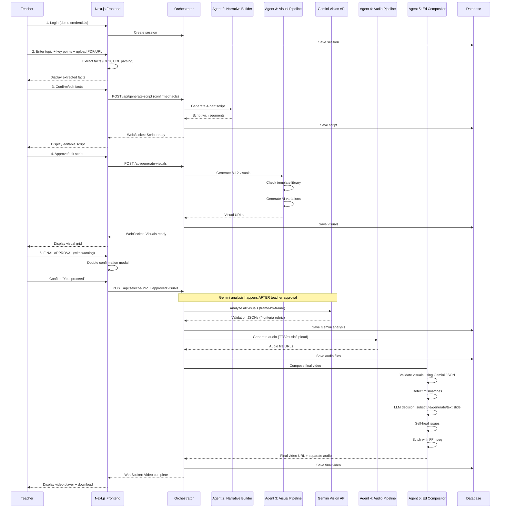

# MVP PRD: AI Educational Video Generator

### Version: 3.0 (Educational Pivot - Implementation-Ready)

### Owner: Nani Skinner — Technical Project Manager

### Sprint Duration: 48 Hours (+ 8-12 hours pre-sprint template preparation)

### Budget: $200 development budget, target $10-15 per video production cost

### Target: Middle School Science Education (Life Science focus)

---

## Table of Contents

1. [Executive Summary](#1-executive-summary)
2. [User Journey & UI Specifications](#2-user-journey--ui-specifications)
3. [Multi-Agent Architecture](#3-multi-agent-architecture)
4. [Agent Specifications](#4-agent-specifications)
5. [Data Models & Database Schema](#5-data-models--database-schema)
6. [API Endpoints](#6-api-endpoints)

---

## 1. Executive Summary

### 1.1 Project Goal

Build an AI-powered educational video generator that produces 60-second middle school science videos with:

- **Scientific accuracy** validated through 4-criteria Gemini rubric
- **Teacher control** at every stage (fact confirmation, script editing, visual approval)
- **Professional educational quality** (1080p, age-appropriate narration, clear diagrams)
- **Cost efficiency** (under $200 budget, target $10-15 per video)
- **Self-healing intelligence** (auto-corrects visual mismatches, falls back to text when needed)

### 1.2 Core Innovation

**Hybrid Template + AI Pipeline with Self-Healing Validation**

- 10 hand-crafted scientifically accurate templates (5 topics × 2 variations each)
- AI generates custom variations when templates don't cover the need
- **Gemini Vision analyzes every frame** using 4-criteria rubric (scientific accuracy, label quality, age-appropriateness, visual clarity)
- **Educational Compositor self-heals** mismatches using LLM-powered decision-making
- **Auto-fallback to text slides** when visual generation fails (maintains educational integrity)
- Teacher-driven iterative workflow with strategic approval gates
- Intelligent orchestration across 5 specialized agents + frontend fact extraction

### 1.3 Technical Stack

| Layer                   | Technology                                        | Rationale                                                                             |
| ----------------------- | ------------------------------------------------- | ------------------------------------------------------------------------------------- |
| **Frontend**            | Next.js 14 (App Router), TypeScript, Tailwind CSS | Modern React framework, handles fact extraction client-side, manages teacher workflow |
| **Backend**             | FastAPI (Python 3.11+), Pydantic v2               | High-performance async API, native type validation                                    |
| **Database**            | PostgreSQL 15 + SQLAlchemy 2.0                    | Session state, template metadata, Gemini analysis storage, cost tracking              |
| **Orchestration**       | Python Async/Await (direct function calls)        | Simple MVP pattern, easy migration to message queue post-MVP                          |
| **Script Generation**   | Replicate: Llama 3.1 70B Instruct                 | Free/low-cost, excellent structured educational output, 4-part narrative structure    |
| **Visual Templates**    | Hand-crafted PSD files (10 templates)             | Guaranteed scientific accuracy for core Life Science concepts                         |
| **Image Generation**    | DALL-E 3 (primary), Midjourney (fallback)         | Best for educational diagrams with accurate labeling and text                         |
| **Visual Validation**   | Google Gemini 1.5 Pro Vision API                  | Frame-by-frame analysis (30fps), 4-criteria rubric, scientific accuracy verification  |
| **Video Generation**    | Stable Video Diffusion (template animations)      | Cost-effective for diagram animations, template-based consistency                     |
| **LLM Decision Engine** | Replicate: Llama 3.1 70B Instruct                 | Powers Ed Compositor self-healing, substitution decisions, text slide generation      |
| **Voiceover (TTS)**     | ElevenLabs (primary), Play.ht (fallback)          | Natural-sounding, age-appropriate middle school voices                                |
| **Video Composition**   | FFmpeg 6.0 (via Python subprocess)                | Industry standard, precise timing control, supports separate audio tracks             |
| **File Storage**        | Temporary local storage → Frontend download       | No cloud storage for MVP, videos viewable/downloadable immediately                    |
| **Deployment**          | Vercel (Frontend), Railway (Backend + PostgreSQL) | Fast deployment, integrated database, demo credentials auth                           |

### 1.4 MVP Scope (48 Hours)

#### **IN SCOPE:**

✅ Single science domain (Life Science for middle school, ages 11-14)
✅ 10 core templates (5 topics × 2 variations):

- **Photosynthesis:** Overview + Chloroplast Detail
- **Cell Structure:** Animal Cell + Plant Cell
- **Cellular Respiration:** Mitochondria Detail + Process Flow
- **Food Chains:** Simple Chain + Food Web
- **Plant Anatomy:** Whole Plant + Vascular System

✅ 60-second educational videos (4-part structure: Hook → Concept → Process → Conclusion)
✅ Teacher input workflow: Topic + Learning Objective + Key Points + Optional uploads/links
✅ Next.js client-side fact extraction (OCR, URL parsing, text processing)
✅ AI script generation with editable 4-segment narration
✅ Template-based + AI hybrid visual generation (8-12 micro-scenes per video)
✅ Gemini frame-by-frame validation (30fps analysis, 4-criteria rubric)
✅ Self-healing Ed Compositor (LLM decisions, auto-generation, text slide fallback)
✅ 4 audio options: AI voiceover (TTS), teacher upload, instrumental music, no audio
✅ Separate audio file generation (for post-MVP editing)
✅ Real-time progress indicators (WebSocket)
✅ Cost tracking per stage ($200 development budget)
✅ Demo authentication (single shared credentials)
✅ Deployed web interface with video preview and download

#### **OUT OF SCOPE (Post-MVP):**

❌ Multiple science domains (Physical Science, Earth Science, Chemistry)
❌ Educational song generation with lyrics
❌ Multiple grade levels (elementary, high school)
❌ Multiple video lengths (30s, 90s, 3min+)
❌ User authentication system (real accounts, personal libraries)
❌ Cloud video storage/library (permanent hosting)
❌ Video sharing features (embed codes, social sharing)
❌ A/B testing / batch generation
❌ Multiple aspect ratios (9:16, 1:1 for social media)
❌ Voiceover with multiple voice options (accents, languages)
❌ Advanced analytics (usage metrics, teacher engagement)
❌ Template library expansion beyond Life Science
❌ Message queue architecture (RabbitMQ/Redis)

---

### 1.5 Key Architectural Decisions

#### **1.5.1 Why Next.js Handles Fact Extraction (No Backend Agent)**

- **Decision:** Frontend performs OCR, URL scraping, and fact extraction before backend involvement
- **Rationale:**
  - Reduces backend complexity (4 agents instead of 5)
  - Better user feedback (immediate client-side processing)
  - Teacher confirms facts locally before API calls
  - Eliminates network round-trip for fact validation
- **Implementation:** Next.js libraries for PDF parsing, URL fetching, text extraction

#### **1.5.2 Why Gemini Runs AFTER Teacher Visual Approval**

- **Decision:** Gemini analyzes visuals after teacher approves them, not before showing to teacher
- **Rationale:**
  - Reduces teacher wait time (2-3 min Gemini analysis happens during composition)
  - Teacher sees visuals faster (immediate feedback loop)
  - Ed Compositor has validation data when it needs it
  - Teacher approval is final gate (no changes after this point)
- **Trade-off:** Teacher might approve visuals that Gemini later flags (but Ed Compositor self-heals)

#### **1.5.3 Why Text Slide Fallback for Failed Visuals**

- **Decision:** Generate educational text slides when visual generation fails after 3 attempts
- **Rationale:**
  - **Educational integrity over aesthetics** - Never show scientifically incorrect content
  - Teacher always receives a complete 60-second video
  - Text slides are still pedagogically valuable (clear concept explanation)
  - Maintains trust (teachers won't use tools that mislead students)
  - Better than blank screens or mismatched visuals
- **Implementation:** Black background + white text + key terms highlighted + disclaimer

#### **1.5.4 Why 4-Criteria Gemini Rubric**

- **Decision:** Validate visuals on 4 dimensions instead of binary pass/fail
- **Criteria:**
  1. Scientific Accuracy (facts, processes, relationships)
  2. Label Quality (spelling, placement, clarity)
  3. Age-Appropriateness (middle school complexity)
  4. Visual Clarity (organization, readability)
- **Rationale:**
  - Multi-dimensional quality assessment
  - Actionable feedback for retry improvements
  - Better Ed Compositor decision-making (knows _why_ something failed)
  - Worth the slight cost increase ($0.003 vs $0.0025 per image)
- **Acceptance:** All 4 must pass + confidence >85%

#### **1.5.5 Why 10 Templates (Not More)**

- **Decision:** 5 topics × 2 variations = 10 total hand-crafted templates for MVP
- **Rationale:**
  - Achievable in pre-sprint preparation (8-12 hours work)
  - Covers most common middle school Life Science lessons
  - Leaves room for AI-generated variations when needed
  - Can expand to 15-20 templates post-MVP based on usage data
- **Coverage:** Photosynthesis, cells, respiration, food chains, plant anatomy

---

### 1.6 Cost Structure

#### **Per-Video Cost Breakdown (Target: $10-15)**

| Component                                     | Model/Service          | Cost           | Notes                                             |
| --------------------------------------------- | ---------------------- | -------------- | ------------------------------------------------- |
| **Fact Extraction**                           | Next.js (client-side)  | $0.00          | Free - runs in browser                            |
| **Script Generation**                         | Llama 3.1 70B          | $0.01          | Nearly free LLM                                   |
| **Visual Scene Planning**                     | Llama 3.1 70B          | $0.01          | LLM-powered scene matching                        |
| **Template Customization**                    | Python/PIL/ImageMagick | $0.00          | Local processing                                  |
| **AI Image Generation** (4-6 images)          | DALL-E 3               | $0.16-0.24     | $0.04 per image, only when templates insufficient |
| **Gemini Validation** (150 frames × 8 scenes) | Gemini 1.5 Pro Vision  | $3.60          | $0.003 per frame, comprehensive analysis          |
| **Emergency Visual Generation** (0-2 images)  | DALL-E 3               | $0-0.08        | Only if self-healing needed                       |
| **TTS Voiceover** (60 seconds)                | ElevenLabs             | $0.50          | $0.30/1K chars, ~1.5K chars for 60s               |
| **Video Composition**                         | FFmpeg (local)         | $0.00          | Free - server processing                          |
| **Text Slide Generation** (if needed)         | FFmpeg (local)         | $0.00          | Fallback option                                   |
| **Total Estimated Cost**                      |                        | **$4.28-4.44** | Well under $15 target ✅                          |

**Cost Variability Factors:**

- More template matches = Lower cost (less AI generation)
- Self-healing success rate affects emergency generation costs
- Audio choice (TTS vs music vs none) changes cost
- Gemini validation is largest single cost but ensures quality

**MVP Development Budget:** $200 for testing/iteration during 48-hour sprint

---

## 2. User Journey & UI Specifications

### 2.1 Complete User Flow



---

### 2.2 Screen-by-Screen Breakdown

#### **Screen 1: Login**

**UI Elements:**

- Simple centered card with:
  - "Educational Video Generator" heading
  - Subheading: "Create 60-second science videos for middle school students"
  - Email input (pre-filled: `demo@example.com`)
  - Password input (pre-filled: `demo123`)
  - "Start Creating" button
- **Action:** Creates session in database, redirects to topic input

**Sample UI (Text):**

```
╔══════════════════════════════════════╗
║   Educational Video Generator         ║
║   Create science videos in 60 seconds ║
║                                        ║
║   Email: [demo@example.com          ] ║
║   Password: [••••••••               ] ║
║                                        ║
║   [      Start Creating       ]        ║
╚══════════════════════════════════════╝
```

---

#### **Screen 2: Topic Input & Fact Extraction**

**UI Elements:**

**Header:** "Step 1: Tell Us What You Want to Teach"

**Main Form:**

- **Topic Input:**

  - Label: "What topic are you teaching?"
  - Input field with placeholder: "e.g., Photosynthesis, Cell Structure, Food Chains"
  - Character limit: 100

- **Learning Objective:**

  - Label: "What should students learn?"
  - Textarea with placeholder: "e.g., Explain how plants make food from sunlight"
  - Character limit: 200

- **Key Points:**
  - Label: "Key concepts to include (comma-separated)"
  - Input field with placeholder: "e.g., chlorophyll, sunlight, glucose, oxygen"
  - Character limit: 300

**Optional Reference Materials (Collapsible Section):**

- **Upload File:**

  - "Upload notes or textbook page (PDF, JPG, PNG)"
  - Drag-and-drop area
  - Max file size: 10MB

- **OR Paste URL:**
  - "Link to educational resource"
  - Input field with placeholder: "https://..."
  - Supported: Khan Academy, educational sites, PDFs

**Action Button:** "Extract Key Facts" (processes files/URLs client-side)

**Processing State (Next.js):**

- Shows spinner: "Extracting facts from your materials..."
- Progress steps:
  - "Reading PDF..." (if uploaded)
  - "Fetching URL content..." (if provided)
  - "Identifying key concepts..."
  - "Organizing facts..."

**Extracted Facts Display:**

- Card showing:

  - **Detected Concepts:** List of key terms (editable chips)
  - **Definitions Found:** Key definitions from materials
  - **Suggested Structure:** Recommended flow based on content

- **Edit Controls:**
  - Can add/remove concepts
  - Can edit definitions
  - Can reorder structure

**Footer:**

- "Facts Ready: 8 concepts identified"
- "Continue to Script Generation" button (disabled until facts confirmed)

---

#### **Screen 3: Script Generation & Review**

**UI Elements:**

**Header:** "Step 2: Review Your Educational Script"

**Script Preview (4-Part Structure):**

**Segment 1: Hook (0-10 seconds)**

- Duration badge: "10s"
- Narration text (editable textarea):
  ```
  "Have you ever wondered how plants make their own food? Let's discover the amazing process of photosynthesis!"
  ```
- Visual guidance preview: "Animated question mark with plant growing time-lapse"
- Edit controls: Pencil icon to edit narration

**Segment 2: Concept Introduction (10-25 seconds)**

- Duration badge: "15s"
- Narration text (editable):
  ```
  "Plants use a process called photosynthesis. Inside their leaves are tiny structures called chloroplasts that contain chlorophyll - the green pigment that captures sunlight."
  ```
- Visual guidance: "Diagram of leaf → zoom to chloroplast → highlight chlorophyll"
- Key concepts highlighted: `chloroplasts`, `chlorophyll`

**Segment 3: Process Explanation (25-45 seconds)**

- Duration badge: "20s"
- Narration text (editable):
  ```
  "When sunlight hits the chlorophyll, it triggers a chemical reaction. The plant takes in carbon dioxide from the air and water from the soil, and converts them into glucose - that's sugar, the plant's food! The chemical equation is: 6CO₂ + 6H₂O + light energy → C₆H₁₂O₆ + 6O₂"
  ```
- Visual guidance: "Animated diagram showing CO₂ + H₂O → glucose + O₂ with arrows"

**Segment 4: Conclusion (45-60 seconds)**

- Duration badge: "15s"
- Narration text (editable):
  ```
  "As a bonus, plants release oxygen as a byproduct. That's the air we breathe! So next time you see a green plant, remember - it's a tiny food factory powered by the sun."
  ```
- Visual guidance: "Real-world footage of child near tree, text overlay with key takeaway"

**Right Sidebar:**

- **Total Duration:** 60 seconds
- **Reading Level:** Grade 6-7 (auto-calculated)
- **Key Terms:** 6 concepts
- **Cost Estimate:** $0.02 (script generation)

**Actions:**

- "Regenerate Script" button (with different focus)
- "Edit Manually" toggle (switches to full text editor)
- **"Approve Script & Generate Visuals"** button (primary CTA)

---

#### **Screen 4: Visual Generation & Review**

**UI Elements:**

**Header:** "Step 3: Review Generated Visuals"

**Progress During Generation (WebSocket updates):**

- "Planning visual scenes..." (5%)
- "Matching templates to script..." (15%)
- "Generating visual 1 of 8..." (30%)
- "Generating visual 2 of 8..." (40%)
- ...
- "All visuals generated!" (100%)

**Visual Grid (8-12 micro-scenes):**

Organized by segment:

**Segment 1: Hook (2 visuals)**

- Visual 1:

  - Thumbnail preview (auto-plays animation)
  - Duration: 5s
  - Type badge: "Template-based"
  - Source: "Plant growth time-lapse"
  - Cost: $0.00 (template)
  - Checkbox (pre-checked)

- Visual 2:
  - Thumbnail preview
  - Duration: 5s
  - Type badge: "AI-generated"
  - Source: "Animated question mark"
  - Cost: $0.04
  - Checkbox (pre-checked)

**Segment 2: Concept (3 visuals)**

- Visual 3: Leaf diagram (template)
- Visual 4: Chloroplast zoom (template)
- Visual 5: Chlorophyll highlight (AI-generated)

**Segment 3: Process (3 visuals)**

- Visual 6: Chemical equation (template)
- Visual 7: CO₂ + H₂O animation (AI-generated)
- Visual 8: Glucose formation (AI-generated)

**Segment 4: Conclusion (2 visuals)**

- Visual 9: Child near tree (AI-generated)
- Visual 10: Key takeaway text overlay (template)

**Right Sidebar:**

- **Visual Summary:**
  - Total visuals: 10
  - Template-based: 5 ($0.00)
  - AI-generated: 5 ($0.20)
  - Total duration: 50 seconds (distributed across 60s with transitions)
- **Cost Tracker:**
  - Script: $0.02
  - Visuals: $0.20
  - Running total: $0.22

**Actions:**

- "Regenerate" button on each visual (individual regeneration)
- "Regenerate All Visuals" (start over with different AI seed)

**⚠️ CRITICAL APPROVAL GATE:**

Large warning box (yellow/orange background):

```
╔═══════════════════════════════════════════════════╗
║  ⚠️  FINAL VISUAL APPROVAL                         ║
║                                                     ║
║  This is your last opportunity to modify visuals.  ║
║  Once approved, visuals cannot be changed before   ║
║  video generation.                                  ║
║                                                     ║
║  Please review each visual carefully to ensure     ║
║  scientific accuracy and educational quality.      ║
╚═══════════════════════════════════════════════════╝
```

**Primary CTA:** "I Approve These Visuals - Proceed to Audio" button

- Clicking triggers double-confirmation modal:

**Confirmation Modal:**

```
╔═══════════════════════════════════════════════════╗
║  Final Confirmation                                 ║
║                                                     ║
║  Are you certain these visuals accurately          ║
║  represent your educational content?                ║
║                                                     ║
║  You have reviewed all 10 visuals and confirm      ║
║  they are scientifically accurate and appropriate  ║
║  for middle school students.                        ║
║                                                     ║
║  [Cancel]  [Yes, I'm Sure - Proceed to Audio]     ║
╚═══════════════════════════════════════════════════╝
```

---

#### **Screen 5: Audio Selection**

**UI Elements:**

**Header:** "Step 4: Choose Your Audio"

**Audio Options (4 cards to choose from):**

**Option 1: AI Voiceover (Recommended)**

- Icon: 🎙️
- Description: "Professional text-to-speech narration of your script"
- Voice preview: Dropdown to select voice
  - "Friendly Female (Rachel)" [Play sample]
  - "Enthusiastic Male (Josh)" [Play sample]
  - "Clear Female (Emily)" [Play sample]
- Cost: +$0.50
- **Pros:**
  - Professional quality
  - Age-appropriate tone
  - Perfect timing sync
- Selected by default

**Option 2: Upload Your Own Voiceover**

- Icon: ⬆️
- Description: "Record or upload your own narration"
- Upload area: Drag MP3/WAV file
- Recording option: "Record in browser" button
- Duration requirement: "Must be ~60 seconds"
- Cost: $0.00
- **Pros:**
  - Personal touch
  - Your authentic voice
  - Free

**Option 3: Instrumental Background Music**

- Icon: 🎵
- Description: "Background music only (no narration)"
- Genre selector:
  - Upbeat/Energetic
  - Calm/Focus
  - Science Documentary Style
- Preview: [Play 10s sample]
- Cost: $0.00 (stock music library)
- **Note:** "Best for videos with heavy text overlays"

**Option 4: No Audio**

- Icon: 🔇
- Description: "Silent video (visuals and text only)"
- Cost: $0.00
- **Note:** "Teacher can narrate live during class"

**Right Sidebar:**

- **Updated Cost:**
  - Script: $0.02
  - Visuals: $0.20
  - Audio: $0.50 (if TTS selected)
  - **Total so far:** $0.72

**Action Button:** "Generate Final Video" (primary CTA)

---

#### **Screen 6: Final Video Generation (Processing)**

**UI Elements:**

**Header:** "Creating Your Educational Video..."

**Progress Stages (WebSocket real-time updates):**

**Stage 1: Visual Analysis (15-20%)**

- "Analyzing visual accuracy with Gemini AI..."
- Substeps:
  - "Analyzing visual 1 of 10..." (frame-by-frame)
  - "Analyzing visual 2 of 10..."
  - ...
  - "Validating scientific accuracy..."
  - "Checking age-appropriateness..."
- Duration: ~2-3 minutes
- Progress bar animates

**Stage 2: Audio Generation (20-30%)** (if TTS selected)

- "Generating voiceover narration..."
- Substeps:
  - "Generating narration for segment 1..."
  - "Generating narration for segment 2..."
  - "Generating narration for segment 3..."
  - "Generating narration for segment 4..."
- Duration: ~30-45 seconds

**Stage 3: Intelligent Composition (30-95%)**

- "Composing your educational video..."
- Substeps:
  - "Validating visual matches to script..." (35%)
  - "Detecting scene mismatches..." (40%)
  - "Self-healing visual issues..." (50%) _[Only shows if mismatches detected]_
  - "Generating replacement visual..." (60%) _[Only if emergency generation needed]_
  - "Creating text slide for segment 3..." (65%) _[Only if fallback needed]_
  - "Synchronizing narration timing..." (70%)
  - "Adding segment transitions..." (80%)
  - "Rendering final composition..." (90%)
  - "Optimizing for web playback..." (95%)
- Duration: ~1-2 minutes

**Stage 4: Finalizing (95-100%)**

- "Generating separate audio files..."
- "Preparing download..."
- "Complete!"

**Cost Tracker (updates in real-time):**

```
╔═══════════════════════════════════════╗
║  Cost Breakdown                        ║
║                                        ║
║  Script Generation:       $0.02        ║
║  Visual Generation:       $0.20        ║
║  Gemini Validation:       $3.60        ║
║  Audio Generation:        $0.50        ║
║  Self-Healing (1 visual): $0.04        ║
║  Composition:             $0.00        ║
║  ─────────────────────────────────     ║
║  Total Cost:              $4.36        ║
╚═══════════════════════════════════════╝
```

**Note Display (if self-healing occurred):**

```
ℹ️ Note: 1 visual was automatically replaced to ensure
scientific accuracy. The system detected a mismatch
and generated a corrected version.
```

---

#### **Screen 7: Final Video Output**

**UI Elements:**

**Header:** "Your Educational Video is Ready! 🎉"

**Video Player:**

- Large embedded HTML5 video player
- Controls: Play/Pause, Volume, Fullscreen, Download
- Autoplay on load (muted initially)
- Resolution display: "1920x1080 (Full HD)"

**Video Information Card:**

**Basic Info:**

- **Topic:** Photosynthesis
- **Duration:** 60 seconds
- **Resolution:** 1920x1080 (Full HD)
- **File Size:** 18.4 MB
- **Format:** MP4 (H.264)

**Content Summary:**

- **Segments:** 4
- **Visuals Used:** 10 (5 template-based, 4 AI-generated, 1 text slide)
- **Audio:** AI Voiceover (Female voice)
- **Key Concepts Covered:** chlorophyll, photosynthesis, glucose, oxygen, chloroplast, light energy

**Quality Metrics:**

- **Scientific Accuracy:** ✅ Validated by Gemini AI
- **Age Level:** Grades 6-7
- **Gemini Confidence:** 92%

**Cost Breakdown (Expandable):**

```
Script Generation:           $0.02
Visual Generation:           $0.20
Gemini Analysis:             $3.60
AI Voiceover:                $0.50
Self-Healing (1 visual):     $0.04
────────────────────────────────
Total Production Cost:       $4.36
```

**Download Options:**

**Primary:**

- **"Download Complete Video (MP4)"** button (large, prominent)
  - Downloads: `photosynthesis_educational_video.mp4`

**Secondary:**

- **"Download Separate Audio Files"** (collapsible)
  - Segment 1 Audio: `audio_segment_1_hook.mp3`
  - Segment 2 Audio: `audio_segment_2_concept.mp3`
  - Segment 3 Audio: `audio_segment_3_process.mp3`
  - Segment 4 Audio: `audio_segment_4_conclusion.mp3`
  - Download All as ZIP

**Actions:**

**Primary Actions:**

- "Generate Another Video" button (starts new session)
- "Share Video Link" button (copies temporary viewing URL - expires in 24 hours)

**Secondary Actions:**

- "View Detailed Report" (shows full Gemini analysis, visual decisions made, etc.)
- "Download Script as PDF" (educational script in formatted document)

---

## 3. Multi-Agent Architecture

### 3.1 System Architecture Diagram

```
┌─────────────────────────────────────────────────────────────────┐
│                    FRONTEND (Next.js 14)                         │
│  ┌──────────────┐  ┌───────────────┐  ┌────────────────────┐  │
│  │  Login UI    │→ │ Fact          │→ │  Script Review     │  │
│  │              │  │ Extraction    │  │  & Approval        │  │
│  │              │  │ (Client-Side) │  │                    │  │
│  └──────────────┘  └───────────────┘  └────────────────────┘  │
│                                                                  │
│  ┌──────────────┐  ┌───────────────┐  ┌────────────────────┐  │
│  │ Visual       │→ │ Audio         │→ │  Final Video       │  │
│  │ Review       │  │ Selection     │  │  Output            │  │
│  │ (FINAL GATE) │  │               │  │                    │  │
│  └──────────────┘  └───────────────┘  └────────────────────┘  │
└────────────────────────────┬────────────────────────────────────┘
                             │ REST API + WebSocket
┌────────────────────────────▼────────────────────────────────────┐
│              BACKEND ORCHESTRATOR (FastAPI)                      │
│  ┌──────────────────────────────────────────────────────────┐  │
│  │           Session State Manager                           │  │
│  │  - Load/Save session from PostgreSQL                     │  │
│  │  - Track generation costs                                │  │
│  │  - Emit WebSocket progress events                        │  │
│  │  - Coordinate sequential agent execution                 │  │
│  └───────────────────┬──────────────────────────────────────┘  │
│                      │                                           │
│  ┌───────────────────▼──────────────────────────────────────┐  │
│  │        Agent Coordinator (Direct Async Calls)             │  │
│  │   Manages sequential agent execution with error handling │  │
│  └─┬──────────┬───────────┬──────────────┬──────────────────┘  │
│    │          │           │              │                      │
│ ┌──▼───────┐ ┌▼────────┐ ┌▼───────────┐ ┌▼──────────────────┐ │
│ │ Agent 2  │ │ Agent 3 │ │  Agent 4   │ │   Agent 5         │ │
│ │Narrative │ │ Visual  │ │   Audio    │ │  Educational      │ │
│ │ Builder  │ │Pipeline │ │  Pipeline  │ │  Compositor       │ │
│ │          │ │         │ │            │ │  (Self-Healing)   │ │
│ └──────────┘ └─────────┘ └────────────┘ └───────────────────┘ │
│                    │                              │              │
│                    │                              │              │
│                    ▼                              ▼              │
│           ┌─────────────────┐          ┌──────────────────┐    │
│           │  Template       │          │  LLM Decision    │    │
│           │  Library        │          │  Engine          │    │
│           │  (10 PSD files) │          │  (Llama 3.1)     │    │
│           └─────────────────┘          └──────────────────┘    │
└─────────────────────────────────────────────────────────────────┘
                             │
┌────────────────────────────▼────────────────────────────────────┐
│                    EXTERNAL SERVICES                             │
│  ┌──────────────┐  ┌──────────────┐  ┌──────────────────────┐ │
│  │  Replicate   │  │  DALL-E 3    │  │  Gemini 1.5 Pro      │ │
│  │  Llama 3.1   │  │  (OpenAI)    │  │  Vision API          │ │
│  │  (LLM)       │  │  (Images)    │  │  (Validation)        │ │
│  └──────────────┘  └──────────────┘  └──────────────────────┘ │
│                                                                  │
│  ┌──────────────┐  ┌──────────────┐  ┌──────────────────────┐ │
│  │  Stable      │  │  ElevenLabs  │  │     FFmpeg           │ │
│  │  Video Diff  │  │  (TTS)       │  │  (Composition)       │ │
│  │  (Animation) │  │              │  │                      │ │
│  └──────────────┘  └──────────────┘  └──────────────────────┘ │
└─────────────────────────────────────────────────────────────────┘
                             │
┌────────────────────────────▼────────────────────────────────────┐
│                  DATABASE (PostgreSQL)                           │
│  - sessions table (state management)                             │
│  - assets table (visual URLs, audio files)                      │
│  - gemini_validations table (frame analysis JSONs)              │
│  - generation_costs table (cost tracking)                        │
│  - templates table (template metadata)                           │
└─────────────────────────────────────────────────────────────────┘
```

### 3.2 Agent Responsibilities

**No Agent 1** - Fact extraction handled by Next.js frontend

**Agent 2: Narrative Builder**

- Input: Confirmed facts from teacher
- Output: 4-part educational script (Hook → Concept → Process → Conclusion)
- Responsibility: Generate age-appropriate, scientifically accurate narration

**Agent 3: Visual Pipeline**

- Input: Approved script segments
- Output: 8-12 visual URLs (mix of templates and AI-generated)
- Responsibility: Match templates, generate AI variations, prepare for Gemini validation

**Agent 4: Audio Pipeline**

- Input: Audio choice (TTS/upload/music/none) + script
- Output: Separate audio file URLs for each segment
- Responsibility: Generate or process audio tracks

**Agent 5: Educational Compositor**

- Input: Script + Visuals + Gemini JSONs + Audio
- Output: Final MP4 video + separate audio files
- Responsibility: Self-healing validation, LLM decisions, text slide fallback, FFmpeg composition

**Gemini Vision API** (not an agent, but critical component)

- Called by: Orchestrator (after teacher visual approval, before compositor)
- Input: Visual URLs
- Output: Frame-by-frame analysis JSONs with 4-criteria validation
- Responsibility: Validate scientific accuracy, label quality, age-appropriateness, visual clarity

---

### 3.3 Data Flow Pattern

```
Teacher Input (Next.js)
    ↓
Confirmed Facts
    ↓
[Agent 2: Narrative Builder] → Script → [Teacher Approves] ✓
    ↓
[Agent 3: Visual Pipeline] → Visuals → [Teacher Approves] ✓✓ (FINAL GATE)
    ↓
[Gemini Vision Analysis] → Validation JSONs (Backend only, teacher doesn't see)
    ↓
[Agent 4: Audio Pipeline] → Audio Files
    ↓
[Agent 5: Ed Compositor]
    ├─ Reads Gemini JSONs
    ├─ Detects mismatches
    ├─ LLM makes decisions
    ├─ Self-heals (substitute/generate/text slide)
    └─ Renders final video
    ↓
Final MP4 + Separate Audio → Teacher Downloads
```

---

## 4. Agent Specifications

### 4.1 Agent Interface Standard

All agents implement this interface for consistency:

```python
from typing import Protocol, TypedDict, Any
from pydantic import BaseModel

class AgentInput(BaseModel):
    """Base input model for all agents"""
    session_id: str
    data: dict[str, Any]
    metadata: dict[str, Any] = {}

class AgentOutput(BaseModel):
    """Base output model for all agents"""
    success: bool
    data: dict[str, Any]
    cost: float  # USD
    duration: float  # seconds
    error: str | None = None

class Agent(Protocol):
    """Standard interface for all agents"""
    async def process(self, input: AgentInput) -> AgentOutput:
        """Process input and return output"""
        ...
```

---

### 4.2 Agent 2: Narrative Builder

**Purpose:** Transform confirmed facts and learning objectives into a 4-part educational script optimized for 60-second middle school science videos.

#### **Input:**

```python
{
    "topic": "Photosynthesis",
    "learning_objective": "Explain how plants make food from sunlight",
    "confirmed_facts": {
        "key_concepts": ["chlorophyll", "chloroplast", "glucose", "oxygen", "CO2", "H2O"],
        "definitions": {
            "photosynthesis": "Process where plants convert light energy to chemical energy",
            "chlorophyll": "Green pigment that captures sunlight",
            "glucose": "Sugar molecule produced as plant food"
        },
        "relationships": [
            "Chloroplasts contain chlorophyll",
            "Sunlight triggers chemical reaction",
            "CO2 + H2O → Glucose + O2"
        ]
    },
    "target_duration": 60,
    "grade_level": "6-7"
}
```

#### **Output:**

```python
{
    "success": True,
    "script": {
        "total_duration": 60,
        "reading_level": "6.5",
        "key_terms_count": 6,
        "segments": [
            {
                "id": "seg_001",
                "type": "hook",
                "start_time": 0,
                "duration": 10,
                "narration": "Have you ever wondered how plants make their own food? Let's discover the amazing process of photosynthesis!",
                "visual_guidance": "Animated question mark with plant growing time-lapse",
                "key_concepts": ["curiosity", "photosynthesis introduction"],
                "educational_purpose": "Engage student interest, introduce topic"
            },
            {
                "id": "seg_002",
                "type": "concept_introduction",
                "start_time": 10,
                "duration": 15,
                "narration": "Plants use a process called photosynthesis. Inside their leaves are tiny structures called chloroplasts that contain chlorophyll - the green pigment that captures sunlight.",
                "visual_guidance": "Diagram of leaf cross-section → zoom to chloroplast → highlight chlorophyll",
                "key_concepts": ["photosynthesis", "chloroplast", "chlorophyll", "leaf structure"],
                "educational_purpose": "Introduce key vocabulary and cellular structures"
            },
            {
                "id": "seg_003",
                "type": "process_explanation",
                "start_time": 25,
                "duration": 20,
                "narration": "When sunlight hits the chlorophyll, it triggers a chemical reaction. The plant takes in carbon dioxide from the air and water from the soil, and converts them into glucose - that's sugar, the plant's food! The chemical equation is: 6CO₂ + 6H₂O + light energy → C₆H₁₂O₆ + 6O₂",
                "visual_guidance": "Animated diagram showing: sunlight → chloroplast → CO2 + H2O → glucose + O2 with arrows and chemical formulas",
                "key_concepts": ["chemical reaction", "carbon dioxide", "water", "glucose", "oxygen", "equation"],
                "educational_purpose": "Explain the scientific process step-by-step"
            },
            {
                "id": "seg_004",
                "type": "conclusion",
                "start_time": 45,
                "duration": 15,
                "narration": "As a bonus, plants release oxygen as a byproduct. That's the air we breathe! So next time you see a green plant, remember - it's a tiny food factory powered by the sun.",
                "visual_guidance": "Real-world scene: child near tree → text overlay with key takeaway: 'Plants = Food Factories Powered by the Sun'",
                "key_concepts": ["oxygen production", "real-world connection", "summary"],
                "educational_purpose": "Connect to student's life, reinforce main concept"
            }
        ]
    },
    "cost": 0.01,
    "duration": 3.2
}
```

#### **LLM Implementation:**

```python
class NarrativeBuilderAgent:
    def __init__(self, replicate_api_key: str):
        self.api_key = replicate_api_key
        self.model = "meta/llama-3.1-70b-instruct"

    async def process(self, input: AgentInput) -> AgentOutput:
        topic = input.data["topic"]
        learning_objective = input.data["learning_objective"]
        confirmed_facts = input.data["confirmed_facts"]
        target_duration = input.data.get("target_duration", 60)
        grade_level = input.data.get("grade_level", "6-7")

        # Build LLM system prompt
        system_prompt = """You are an expert middle school science educator specializing in creating engaging, accurate educational video scripts.

Your task:
1. Create a 4-part educational script (Hook → Concept → Process → Conclusion)
2. Each part has specific timing and purpose
3. Use age-appropriate language for grades 6-7 (reading level ~6.5)
4. Include all confirmed facts and key concepts
5. Provide visual guidance for each segment
6. Ensure scientific accuracy

Structure:
- Hook (0-10s): Engage with question or surprising fact
- Concept Introduction (10-25s): Introduce key vocabulary and ideas
- Process Explanation (25-45s): Explain how/why it works with details
- Conclusion (45-60s): Real-world connection and summary

Rules:
- Total duration must be {target_duration} seconds
- Use conversational, enthusiastic tone
- Define technical terms when first introduced
- Include concrete examples
- End with memorable takeaway
- Output valid JSON only

Required JSON structure:
{{
    "total_duration": {target_duration},
    "reading_level": "6.5",
    "key_terms_count": <number>,
    "segments": [
        {{
            "id": "seg_001",
            "type": "hook|concept_introduction|process_explanation|conclusion",
            "start_time": <seconds>,
            "duration": <seconds>,
            "narration": "<script text>",
            "visual_guidance": "<description of what should be shown>",
            "key_concepts": ["<concept1>", "<concept2>"],
            "educational_purpose": "<why this segment matters>"
        }},
        ...
    ]
}}"""

        user_prompt = f"""Topic: {topic}

Learning Objective: {learning_objective}

Confirmed Facts to Include:
{json.dumps(confirmed_facts, indent=2)}

Target Duration: {target_duration} seconds
Grade Level: {grade_level}

Generate an engaging, scientifically accurate educational script."""

        # Call Replicate Llama 3.1
        start_time = time.time()
        response = await self._call_replicate_llm(
            system_prompt=system_prompt.format(target_duration=target_duration),
            user_prompt=user_prompt
        )
        duration = time.time() - start_time

        # Parse JSON response
        script_data = json.loads(response)

        # Validate script
        self._validate_script(script_data, target_duration)

        return AgentOutput(
            success=True,
            data={"script": script_data},
            cost=0.01,  # Llama 3.1 is very cheap
            duration=duration
        )

    def _validate_script(self, script: dict, target_duration: int):
        """Ensure script meets requirements"""
        total_duration = sum(seg["duration"] for seg in script["segments"])

        if abs(total_duration - target_duration) > 5:
            raise ValueError(f"Script duration {total_duration}s doesn't match target {target_duration}s")

        if len(script["segments"]) != 4:
            raise ValueError(f"Script must have exactly 4 segments, got {len(script['segments'])}")

        required_types = ["hook", "concept_introduction", "process_explanation", "conclusion"]
        segment_types = [seg["type"] for seg in script["segments"]]

        if segment_types != required_types:
            raise ValueError(f"Invalid segment types: {segment_types}")

    async def _call_replicate_llm(self, system_prompt: str, user_prompt: str) -> str:
        """Call Replicate Llama 3.1 API"""
        import replicate

        output = await replicate.async_run(
            self.model,
            input={
                "system_prompt": system_prompt,
                "prompt": user_prompt,
                "max_tokens": 3000,
                "temperature": 0.7,
                "top_p": 0.9
            }
        )

        full_response = "".join(output)
        return full_response
```

#### **Cost & Performance:**

- **Model:** Replicate Llama 3.1 70B Instruct
- **Cost:** ~$0.01 per script
- **Duration:** 3-5 seconds
- **Tokens:** ~800 input + 2000 output = 2800 total

---

### 4.3 Agent 3: Visual Pipeline

**Purpose:** Generate 8-12 educational visuals using hybrid template + AI approach, matching script segments with scientifically accurate diagrams and animations.

#### **Input:**

```python
{
    "session_id": "sess_001",
    "script": {
        "segments": [
            {
                "id": "seg_001",
                "type": "hook",
                "duration": 10,
                "narration": "...",
                "visual_guidance": "Animated question mark with plant growing time-lapse",
                "key_concepts": ["curiosity", "photosynthesis introduction"]
            },
            {
                "id": "seg_002",
                "type": "concept_introduction",
                "duration": 15,
                "visual_guidance": "Diagram of leaf cross-section → zoom to chloroplast → highlight chlorophyll",
                "key_concepts": ["photosynthesis", "chloroplast", "chlorophyll"]
            },
            # ... more segments
        ]
    },
    "topic": "photosynthesis",
    "template_library": "life_science"
}
```

#### **Output:**

```python
{
    "success": True,
    "visuals": [
        {
            "id": "vis_001",
            "segment_id": "seg_001",
            "sequence": 1,
            "type": "ai_generated",
            "url": "https://storage/animated_question_plant.mp4",
            "template_used": None,
            "duration": 5,
            "description": "Animated question mark morphing into growing plant time-lapse",
            "generation_method": "dall-e-3-video",
            "cost": 0.04,
            "metadata": {
                "prompt": "Animated question mark dissolving into time-lapse of plant growing, educational style",
                "seed": 12345,
                "resolution": "1024x1024"
            }
        },
        {
            "id": "vis_002",
            "segment_id": "seg_002",
            "sequence": 1,
            "type": "template_based",
            "url": "https://storage/photosynthesis_leaf_cross_section.png",
            "template_used": "photosynthesis_overview",
            "duration": 5,
            "description": "Leaf cross-section diagram showing cellular structure",
            "generation_method": "template_customization",
            "cost": 0.00,
            "metadata": {
                "template_file": "photosynthesis_overview.psd",
                "customizations": ["labels: updated", "colors: enhanced"]
            }
        },
        # ... 8-12 total visuals
    ],
    "total_cost": 0.20,
    "total_duration": 50  # Distributed across 60s video with transitions
}
```

---

### 4.4 Gemini Vision Analysis

**Purpose:** Validate educational visuals frame-by-frame using 4-criteria rubric to ensure scientific accuracy before composition.

**Note:** This is called by the Orchestrator AFTER teacher visual approval, not by Visual Pipeline.

#### **4-Criteria Rubric:**

1. **Scientific Accuracy** - Facts, processes, relationships correct
2. **Label Quality** - Spelling, placement, clarity
3. **Age-Appropriateness** - Middle school complexity level
4. **Visual Clarity** - Organization, readability

#### **Output Format (per visual):**

```python
{
    "visual_id": "vis_001",
    "total_frames_analyzed": 150,  # 5 seconds at 30fps
    "validation_results": {
        "scientific_accuracy": {
            "pass": True,
            "confidence": 0.95,
            "issues": [],
            "details": "All structures labeled correctly. Processes shown accurately."
        },
        "label_quality": {
            "pass": True,
            "confidence": 0.92,
            "issues": [],
            "details": "All labels spelled correctly. Clear arrows pointing to structures."
        },
        "age_appropriateness": {
            "pass": True,
            "confidence": 0.90,
            "issues": [],
            "details": "Complexity suitable for grades 6-7."
        },
        "visual_clarity": {
            "pass": True,
            "confidence": 0.94,
            "issues": [],
            "details": "Clear organization. Good use of white space."
        }
    },
    "overall_assessment": {
        "all_criteria_pass": True,
        "overall_confidence": 0.93,
        "recommended_action": "accept",
        "summary": "Excellent educational diagram. Scientifically accurate, age-appropriate, and visually clear.",
        "matches_script_concepts": True
    }
}
```

---

### 4.5 Agent 4: Audio Pipeline

**Purpose:** Generate or process audio for educational videos based on teacher's choice (TTS, upload, music, or none).

#### **Audio Options:**

1. **AI Voiceover (TTS)** - ElevenLabs, ~$0.50 for 60s
2. **Teacher Upload** - Custom narration, $0.00
3. **Instrumental Music** - Stock library, $0.00
4. **No Audio** - Silent video, $0.00

---

### 4.6 Agent 5: Educational Compositor (Self-Healing)

**Purpose:** Stitch all assets together with intelligent validation, self-healing mismatches using LLM decisions, auto-generating missing visuals, falling back to text slides when needed.

#### **Self-Healing Decision Tree:**

```
Visual Validation Check
    ↓
Gemini JSON: All 4 criteria pass?
    ↓ YES → Use visual as-is
    ↓ NO
    ↓
OPTION 1: Find substitute from approved visuals?
    ↓ YES → Use substitute
    ↓ NO
    ↓
OPTION 2: Emergency AI generation (3 attempts)
    ↓ SUCCESS → Use new visual
    ↓ FAIL
    ↓
OPTION 3: Text slide fallback
    ↓
Generate educational text slide with FFmpeg
    ↓
Final video complete
```

---

## 5. Data Models & Database Schema

### 5.1 Pydantic Models

```python
from pydantic import BaseModel, Field, HttpUrl
from datetime import datetime
from enum import Enum
from typing import Optional

class SessionStage(str, Enum):
    CREATED = "created"
    FACTS_CONFIRMED = "facts_confirmed"
    SCRIPT_GENERATION = "script_generation"
    SCRIPT_APPROVED = "script_approved"
    VISUAL_GENERATION = "visual_generation"
    VISUAL_APPROVED = "visual_approved"  # FINAL GATE
    GEMINI_ANALYSIS = "gemini_analysis"
    AUDIO_GENERATION = "audio_generation"
    FINAL_COMPOSITION = "final_composition"
    COMPLETE = "complete"
    FAILED = "failed"

class AssetType(str, Enum):
    IMAGE = "image"
    VIDEO = "video"
    AUDIO = "audio"
    TEXT_SLIDE = "text_slide"
    FINAL_VIDEO = "final_video"

class AudioType(str, Enum):
    AI_VOICEOVER = "ai_voiceover"
    TEACHER_UPLOAD = "teacher_upload"
    INSTRUMENTAL = "instrumental"
    NO_AUDIO = "no_audio"

# ==================== REQUEST MODELS ====================

class ConfirmedFacts(BaseModel):
    """Facts confirmed by teacher (from Next.js)"""
    key_concepts: list[str]
    definitions: dict[str, str]
    relationships: list[str]

class GenerateScriptRequest(BaseModel):
    session_id: str
    topic: str = Field(..., min_length=3, max_length=100)
    learning_objective: str = Field(..., min_length=10, max_length=200)
    confirmed_facts: ConfirmedFacts
    target_duration: int = Field(default=60, ge=30, le=180)
    grade_level: str = Field(default="6-7")

class ApproveScriptRequest(BaseModel):
    session_id: str
    approved_script: dict  # Can include edits

class GenerateVisualsRequest(BaseModel):
    session_id: str

class ApproveVisualsRequest(BaseModel):
    session_id: str
    # Final confirmation

class SelectAudioRequest(BaseModel):
    session_id: str
    audio_choice: dict

# ==================== RESPONSE MODELS ====================

class ScriptSegment(BaseModel):
    id: str
    type: str
    start_time: int
    duration: int
    narration: str
    visual_guidance: str
    key_concepts: list[str]
    educational_purpose: str

class GeneratedScript(BaseModel):
    total_duration: int
    reading_level: str
    key_terms_count: int
    segments: list[ScriptSegment]

class VisualAsset(BaseModel):
    id: str
    segment_id: str
    sequence: int
    type: str
    url: HttpUrl
    template_used: Optional[str]
    duration: float
    description: str
    generation_method: str
    cost: float
    metadata: dict

class SessionResponse(BaseModel):
    id: str
    user_id: int
    stage: SessionStage
    topic: Optional[str]
    learning_objective: Optional[str]
    confirmed_facts: Optional[ConfirmedFacts]
    generated_script: Optional[GeneratedScript]
    generated_visuals: list[VisualAsset]
    total_cost: float
    created_at: datetime
    updated_at: datetime
```

### 5.2 Database Schema (PostgreSQL)

```sql
-- Sessions table
CREATE TABLE sessions (
    id VARCHAR(36) PRIMARY KEY,
    user_id INTEGER NOT NULL DEFAULT 1,
    stage VARCHAR(50) NOT NULL DEFAULT 'created',

    -- Educational content
    topic VARCHAR(100),
    learning_objective VARCHAR(200),
    confirmed_facts JSONB,

    -- Generated content
    generated_script JSONB,
    generated_visual_ids JSONB DEFAULT '[]'::jsonb,
    gemini_validation_ids JSONB DEFAULT '[]'::jsonb,
    audio_type VARCHAR(30),
    audio_segment_ids JSONB DEFAULT '[]'::jsonb,
    final_video_id VARCHAR(36),
    separate_audio_file_urls JSONB DEFAULT '[]'::jsonb,

    -- Composition metadata
    composition_log JSONB DEFAULT '[]'::jsonb,
    self_healing_summary JSONB,

    -- Cost tracking
    total_cost DECIMAL(10, 4) DEFAULT 0.0,

    -- Timestamps
    created_at TIMESTAMP WITH TIME ZONE DEFAULT NOW(),
    updated_at TIMESTAMP WITH TIME ZONE DEFAULT NOW()
);

CREATE INDEX idx_sessions_user_id ON sessions(user_id);
CREATE INDEX idx_sessions_stage ON sessions(stage);

-- Assets table
CREATE TABLE assets (
    id VARCHAR(36) PRIMARY KEY,
    session_id VARCHAR(36) NOT NULL,
    asset_type VARCHAR(20) NOT NULL,
    url VARCHAR(500) NOT NULL,
    segment_id VARCHAR(36),
    sequence INTEGER,
    duration DECIMAL(10, 2),
    generation_method VARCHAR(100),
    template_used VARCHAR(100),
    metadata JSONB,
    cost DECIMAL(10, 4) NOT NULL DEFAULT 0.0,
    created_at TIMESTAMP WITH TIME ZONE DEFAULT NOW(),
    FOREIGN KEY (session_id) REFERENCES sessions(id) ON DELETE CASCADE
);

CREATE INDEX idx_assets_session_id ON assets(session_id);

-- Gemini validations table
CREATE TABLE gemini_validations (
    id VARCHAR(36) PRIMARY KEY,
    session_id VARCHAR(36) NOT NULL,
    visual_id VARCHAR(36) NOT NULL,
    total_frames_analyzed INTEGER NOT NULL,
    frame_by_frame JSONB,
    scientific_accuracy JSONB NOT NULL,
    label_quality JSONB NOT NULL,
    age_appropriateness JSONB NOT NULL,
    visual_clarity JSONB NOT NULL,
    all_criteria_pass BOOLEAN NOT NULL,
    overall_confidence DECIMAL(5, 2) NOT NULL,
    recommended_action VARCHAR(20) NOT NULL,
    summary TEXT,
    matches_script_concepts BOOLEAN NOT NULL,
    created_at TIMESTAMP WITH TIME ZONE DEFAULT NOW(),
    FOREIGN KEY (session_id) REFERENCES sessions(id) ON DELETE CASCADE
);

-- Templates table
CREATE TABLE templates (
    id VARCHAR(36) PRIMARY KEY,
    template_id VARCHAR(100) UNIQUE NOT NULL,
    topic VARCHAR(100) NOT NULL,
    variation VARCHAR(100) NOT NULL,
    filename VARCHAR(200) NOT NULL,
    file_path VARCHAR(500) NOT NULL,
    preview_url VARCHAR(500),
    covers_concepts JSONB NOT NULL,
    visual_type VARCHAR(50) NOT NULL,
    customizable_elements JSONB NOT NULL,
    validated BOOLEAN DEFAULT FALSE,
    validator_name VARCHAR(200),
    validation_date TIMESTAMP WITH TIME ZONE,
    created_at TIMESTAMP WITH TIME ZONE DEFAULT NOW()
);

-- Users table (demo only for MVP)
CREATE TABLE users (
    id SERIAL PRIMARY KEY,
    email VARCHAR(255) UNIQUE NOT NULL,
    password_hash VARCHAR(255) NOT NULL,
    created_at TIMESTAMP WITH TIME ZONE DEFAULT NOW()
);

-- Insert demo user
INSERT INTO users (email, password_hash) VALUES
('demo@example.com', '$2b$12$demo_hash_placeholder');
```

---

## 6. API Endpoints

### 6.1 Authentication

#### POST /api/auth/login

**Request:**

```json
{
  "email": "demo@example.com",
  "password": "demo123"
}
```

**Response:**

```json
{
  "success": true,
  "user_id": 1,
  "email": "demo@example.com",
  "token": "jwt_token_here"
}
```

---

### 6.2 Session Management

#### POST /api/sessions/create

**Request:**

```json
{
  "user_id": 1
}
```

**Response:**

```json
{
  "session_id": "550e8400-e29b-41d4-a716-446655440000",
  "stage": "created",
  "created_at": "2025-01-15T10:30:00Z"
}
```

---

#### GET /api/sessions/{session_id}

**Response:**

```json
{
  "id": "550e8400-e29b-41d4-a716-446655440000",
  "stage": "script_approved",
  "topic": "Photosynthesis",
  "learning_objective": "Explain how plants make food from sunlight",
  "confirmed_facts": {...},
  "generated_script": {...},
  "total_cost": 0.25,
  "created_at": "2025-01-15T10:30:00Z",
  "updated_at": "2025-01-15T10:35:00Z"
}
```

---

### 6.3 Content Generation

#### POST /api/generate-script

**Request:**

```json
{
  "session_id": "550e8400-e29b-41d4-a716-446655440000",
  "topic": "Photosynthesis",
  "learning_objective": "Explain how plants make food from sunlight",
  "confirmed_facts": {
    "key_concepts": ["chlorophyll", "chloroplast", "glucose"],
    "definitions": {},
    "relationships": []
  }
}
```

**Response:**

```json
{
  "status": "processing",
  "estimated_duration": 5,
  "message": "Script generation started. Connect to WebSocket for progress updates."
}
```

---

#### POST /api/generate-visuals

**Request:**

```json
{
  "session_id": "550e8400-e29b-41d4-a716-446655440000"
}
```

**Response:**

```json
{
  "status": "processing",
  "estimated_duration": 60,
  "message": "Visual generation started."
}
```

---

#### POST /api/approve-visuals-final

**CRITICAL: Final approval gate before composition**

**Request:**

```json
{
  "session_id": "550e8400-e29b-41d4-a716-446655440000",
  "double_confirmed": true
}
```

**Response:**

```json
{
  "success": true,
  "message": "Visuals finalized. Proceeding to audio selection.",
  "next_stage": "audio_selection"
}
```

---

#### POST /api/select-audio

**Request:**

```json
{
  "session_id": "550e8400-e29b-41d4-a716-446655440000",
  "audio_choice": {
    "type": "ai_voiceover",
    "config": {
      "voice_id": "rachel_friendly_female",
      "speed": 1.0
    }
  }
}
```

**Response:**

```json
{
  "status": "processing",
  "estimated_duration": 180,
  "message": "Generating audio and composing final video..."
}
```

---

### 6.4 WebSocket

#### WS /ws/{session_id}

**Real-time progress updates**

**Message Format:**

```json
{
  "session_id": "550e8400-e29b-41d4-a716-446655440000",
  "stage": "visual_generation",
  "progress": 45,
  "message": "Generating visual 4 of 8...",
  "current_cost": 0.16,
  "timestamp": "2025-01-15T10:35:15Z"
}
```

---

## Summary of Part 1

This document covers sections 1-6 of the Educational Video Generator MVP PRD:

1. **Executive Summary** - Goals, innovation, technical stack, scope
2. **User Journey** - Complete screen-by-screen UI specifications
3. **Multi-Agent Architecture** - System diagram and data flow
4. **Agent Specifications** - Detailed specs for each agent
5. **Data Models** - Pydantic models and database schema
6. **API Endpoints** - Complete REST and WebSocket API

**Next:** Continue with Part 2 (sections 7-14) which covers Frontend Components, Model Selection, Implementation Sequence, Testing, Deployment, and Appendices.

---

**Document Metadata:**

- Version: 3.0 (Part 1 of 2)
- Last Updated: January 15, 2025
- Owner: Nani Skinner
- Status: Ready for Implementation

# Educational Video Generator MVP PRD - Part 2 (Continuation)

## 7. Frontend Components (Continued)

### 7.1 Project Structure (Continued)

```
frontend/
└── components/
    └── ui/
        ├── Button.tsx
        ├── Input.tsx
        ├── Textarea.tsx
        ├── Card.tsx
        ├── Modal.tsx
        ├── Progress.tsx
        ├── Badge.tsx
        └── Alert.tsx
├── lib/
│   ├── api.ts (API client)
│   ├── websocket.ts (WebSocket manager)
│   ├── fact-extraction.ts (OCR, URL parsing)
│   └── types.ts (TypeScript interfaces)
├── hooks/
│   ├── useSession.ts
│   ├── useWebSocket.ts
│   ├── useFactExtraction.ts
│   └── useVideoGeneration.ts
└── public/
    └── fonts/
```

---

### 7.2 Key Frontend Components

#### **TopicInput.tsx** (Next.js Fact Extraction)

```typescript
"use client";

import { useState } from "react";
import { Button } from "@/components/ui/button";
import { Input } from "@/components/ui/input";
import { Textarea } from "@/components/ui/textarea";
import { FileUpload } from "./FileUpload";
import { useFactExtraction } from "@/hooks/useFactExtraction";

export function TopicInput({ sessionId, onFactsExtracted }: TopicInputProps) {
  const [topic, setTopic] = useState("");
  const [learningObjective, setLearningObjective] = useState("");
  const [keyPoints, setKeyPoints] = useState("");
  const [uploadedFile, setUploadedFile] = useState<File | null>(null);
  const [urlLink, setUrlLink] = useState("");

  const { extractFacts, isExtracting, extractedFacts } = useFactExtraction();

  const handleExtract = async () => {
    await extractFacts({
      topic,
      learningObjective,
      keyPoints,
      uploadedFile,
      urlLink,
    });
  };

  return (
    <div className="space-y-6">
      <div>
        <label className="text-sm font-medium">Topic</label>
        <Input
          value={topic}
          onChange={(e) => setTopic(e.target.value)}
          placeholder="e.g., Photosynthesis, Cell Structure"
          maxLength={100}
        />
      </div>

      <div>
        <label className="text-sm font-medium">Learning Objective</label>
        <Textarea
          value={learningObjective}
          onChange={(e) => setLearningObjective(e.target.value)}
          placeholder="What should students learn?"
          maxLength={200}
          rows={3}
        />
      </div>

      <div>
        <label className="text-sm font-medium">Key Points</label>
        <Input
          value={keyPoints}
          onChange={(e) => setKeyPoints(e.target.value)}
          placeholder="chlorophyll, sunlight, glucose, oxygen"
          maxLength={300}
        />
      </div>

      <div className="border-t pt-6">
        <h3 className="text-sm font-medium mb-4">
          Optional: Add Reference Materials
        </h3>

        <FileUpload
          onFileSelect={setUploadedFile}
          acceptedFormats={["pdf", "jpg", "png"]}
        />

        <div className="mt-4">
          <label className="text-sm font-medium">Or paste a URL</label>
          <Input
            value={urlLink}
            onChange={(e) => setUrlLink(e.target.value)}
            placeholder="https://khanacademy.org/..."
            type="url"
          />
        </div>
      </div>

      <Button
        onClick={handleExtract}
        disabled={!topic || !learningObjective || isExtracting}
        size="lg"
        className="w-full"
      >
        {isExtracting ? "Extracting Facts..." : "Extract Key Facts"}
      </Button>

      {isExtracting && (
        <div className="bg-blue-50 p-4 rounded-lg">
          <p className="text-sm text-blue-900">Processing your materials...</p>
          <Progress value={50} className="mt-2" />
        </div>
      )}
    </div>
  );
}
```

---

#### **useFactExtraction.ts** (Client-Side Processing Hook)

```typescript
import { useState } from "react";
import * as pdfjsLib from "pdfjs-dist";

interface FactExtractionInput {
  topic: string;
  learningObjective: string;
  keyPoints: string;
  uploadedFile: File | null;
  urlLink: string;
}

interface ExtractedFacts {
  key_concepts: string[];
  definitions: Record<string, string>;
  relationships: string[];
}

export function useFactExtraction() {
  const [isExtracting, setIsExtracting] = useState(false);
  const [extractedFacts, setExtractedFacts] = useState<ExtractedFacts | null>(
    null
  );
  const [error, setError] = useState<string | null>(null);

  const extractFacts = async (input: FactExtractionInput) => {
    setIsExtracting(true);
    setError(null);

    try {
      // Base facts from user input
      const baseConcepts = input.keyPoints
        .split(",")
        .map((s) => s.trim())
        .filter(Boolean);

      let additionalText = "";

      // Extract from PDF if provided
      if (input.uploadedFile && input.uploadedFile.type === "application/pdf") {
        additionalText = await extractTextFromPDF(input.uploadedFile);
      }

      // Fetch from URL if provided
      if (input.urlLink) {
        const urlText = await fetchURLContent(input.urlLink);
        additionalText += "\n" + urlText;
      }

      // Process extracted text to find concepts
      const extractedConcepts = extractConceptsFromText(additionalText);

      // Combine with user-provided concepts
      const allConcepts = [...new Set([...baseConcepts, ...extractedConcepts])];

      // Extract definitions
      const definitions = extractDefinitionsFromText(additionalText);

      // Extract relationships
      const relationships = extractRelationshipsFromText(additionalText);

      const facts: ExtractedFacts = {
        key_concepts: allConcepts,
        definitions,
        relationships,
      };

      setExtractedFacts(facts);
      return facts;
    } catch (err) {
      setError(err instanceof Error ? err.message : "Extraction failed");
      throw err;
    } finally {
      setIsExtracting(false);
    }
  };

  return { extractFacts, isExtracting, extractedFacts, error };
}

// Helper: Extract text from PDF
async function extractTextFromPDF(file: File): Promise<string> {
  const arrayBuffer = await file.arrayBuffer();
  const pdf = await pdfjsLib.getDocument({ data: arrayBuffer }).promise;

  let fullText = "";

  for (let i = 1; i <= pdf.numPages; i++) {
    const page = await pdf.getPage(i);
    const textContent = await page.getTextContent();
    const pageText = textContent.items.map((item: any) => item.str).join(" ");
    fullText += pageText + "\n";
  }

  return fullText;
}

// Helper: Fetch content from URL
async function fetchURLContent(url: string): Promise<string> {
  try {
    const response = await fetch(
      `/api/fetch-url?url=${encodeURIComponent(url)}`
    );
    if (!response.ok) throw new Error("Failed to fetch URL");
    const data = await response.json();
    return data.content || "";
  } catch (err) {
    console.error("URL fetch error:", err);
    return "";
  }
}

// Helper: Extract scientific concepts from text
function extractConceptsFromText(text: string): string[] {
  const concepts: string[] = [];

  // Common scientific terms patterns
  const scienceKeywords = [
    /photosynthesis/gi,
    /chlorophyll/gi,
    /chloroplast/gi,
    /glucose/gi,
    /mitochondria/gi,
    /respiration/gi,
    /oxygen/gi,
    /carbon dioxide/gi,
    /cell/gi,
    /nucleus/gi,
    /membrane/gi,
  ];

  scienceKeywords.forEach((regex) => {
    const matches = text.match(regex);
    if (matches && matches.length > 0) {
      concepts.push(matches[0].toLowerCase());
    }
  });

  return [...new Set(concepts)]; // Remove duplicates
}

// Helper: Extract definitions from text
function extractDefinitionsFromText(text: string): Record<string, string> {
  const definitions: Record<string, string> = {};

  // Look for patterns like "X is defined as..." or "X: definition"
  const definitionPatterns = [
    /(\w+)\s+is\s+defined\s+as\s+([^.]+)\./gi,
    /(\w+):\s+([^.]+)\./gi,
  ];

  definitionPatterns.forEach((pattern) => {
    const matches = text.matchAll(pattern);
    for (const match of matches) {
      const term = match[1].toLowerCase();
      const definition = match[2].trim();
      if (term.length > 3 && definition.length > 10) {
        definitions[term] = definition;
      }
    }
  });

  return definitions;
}

// Helper: Extract relationships from text
function extractRelationshipsFromText(text: string): string[] {
  const relationships: string[] = [];

  // Look for causal patterns
  const relationshipPatterns = [
    /(\w+)\s+causes\s+(\w+)/gi,
    /(\w+)\s+produces\s+(\w+)/gi,
    /(\w+)\s+contains\s+(\w+)/gi,
    /(\w+)\s+→\s+(\w+)/gi,
  ];

  relationshipPatterns.forEach((pattern) => {
    const matches = text.matchAll(pattern);
    for (const match of matches) {
      relationships.push(`${match[1]} → ${match[2]}`);
    }
  });

  return [...new Set(relationships)];
}
```

---

#### **FinalApprovalWarning.tsx**

```typescript
"use client";

import { Alert, AlertDescription, AlertTitle } from "@/components/ui/alert";
import { AlertTriangle } from "lucide-react";

export function FinalApprovalWarning() {
  return (
    <Alert variant="warning" className="border-orange-500 bg-orange-50">
      <AlertTriangle className="h-5 w-5 text-orange-600" />
      <AlertTitle className="text-orange-900 font-semibold">
        ⚠️ FINAL VISUAL APPROVAL
      </AlertTitle>
      <AlertDescription className="text-orange-800 mt-2">
        <p className="mb-2">
          This is your last opportunity to modify visuals. Once approved,
          visuals cannot be changed before video generation.
        </p>
        <p className="font-medium">
          Please review each visual carefully to ensure scientific accuracy and
          educational quality.
        </p>
      </AlertDescription>
    </Alert>
  );
}
```

---

#### **DoubleConfirmationModal.tsx**

```typescript
"use client";

import { useState } from "react";
import { Button } from "@/components/ui/button";
import {
  Dialog,
  DialogContent,
  DialogHeader,
  DialogTitle,
  DialogFooter,
} from "@/components/ui/dialog";

interface DoubleConfirmationModalProps {
  isOpen: boolean;
  onClose: () => void;
  onConfirm: () => void;
  visualCount: number;
}

export function DoubleConfirmationModal({
  isOpen,
  onClose,
  onConfirm,
  visualCount,
}: DoubleConfirmationModalProps) {
  const [isChecked, setIsChecked] = useState(false);

  const handleConfirm = () => {
    if (isChecked) {
      onConfirm();
    }
  };

  return (
    <Dialog open={isOpen} onOpenChange={onClose}>
      <DialogContent className="max-w-md">
        <DialogHeader>
          <DialogTitle>Final Confirmation Required</DialogTitle>
        </DialogHeader>

        <div className="space-y-4 py-4">
          <p className="text-sm text-gray-700">
            Are you certain these visuals accurately represent your educational
            content?
          </p>

          <div className="bg-blue-50 p-4 rounded-lg">
            <p className="text-sm text-blue-900 font-medium">
              You have reviewed all {visualCount} visuals and confirm they are:
            </p>
            <ul className="mt-2 space-y-1 text-sm text-blue-800 ml-4">
              <li>✓ Scientifically accurate</li>
              <li>✓ Age-appropriate for middle school</li>
              <li>✓ Clearly labeled</li>
              <li>✓ Aligned with your script</li>
            </ul>
          </div>

          <div className="flex items-start space-x-2">
            <input
              type="checkbox"
              id="final-confirm"
              checked={isChecked}
              onChange={(e) => setIsChecked(e.target.checked)}
              className="mt-1"
            />
            <label
              htmlFor="final-confirm"
              className="text-sm text-gray-700 cursor-pointer"
            >
              I understand this is my final chance to make changes, and I
              approve these visuals for video generation.
            </label>
          </div>
        </div>

        <DialogFooter>
          <Button variant="outline" onClick={onClose}>
            Cancel - Review Again
          </Button>
          <Button
            onClick={handleConfirm}
            disabled={!isChecked}
            className="bg-green-600 hover:bg-green-700"
          >
            Yes, I'm Sure - Proceed to Audio
          </Button>
        </DialogFooter>
      </DialogContent>
    </Dialog>
  );
}
```

---

#### **useWebSocket.ts** (Real-time Progress Hook)

```typescript
"use client";

import { useEffect, useState, useRef, useCallback } from "react";

interface ProgressUpdate {
  session_id: string;
  stage: string;
  progress: number;
  message: string;
  current_cost?: number;
  data?: any;
  timestamp: string;
}

export function useWebSocket(sessionId: string) {
  const [isConnected, setIsConnected] = useState(false);
  const [lastUpdate, setLastUpdate] = useState<ProgressUpdate | null>(null);
  const [allUpdates, setAllUpdates] = useState<ProgressUpdate[]>([]);
  const wsRef = useRef<WebSocket | null>(null);

  useEffect(() => {
    // Determine WebSocket URL based on environment
    const wsProtocol = window.location.protocol === "https:" ? "wss:" : "ws:";
    const wsHost =
      process.env.NEXT_PUBLIC_API_URL?.replace("http://", "").replace(
        "https://",
        ""
      ) || "localhost:8000";
    const wsUrl = `${wsProtocol}//${wsHost}/ws/${sessionId}`;

    const ws = new WebSocket(wsUrl);

    ws.onopen = () => {
      console.log("WebSocket connected");
      setIsConnected(true);
    };

    ws.onmessage = (event) => {
      try {
        const update: ProgressUpdate = JSON.parse(event.data);
        console.log("WebSocket update:", update);
        setLastUpdate(update);
        setAllUpdates((prev) => [...prev, update]);
      } catch (err) {
        console.error("Failed to parse WebSocket message:", err);
      }
    };

    ws.onerror = (error) => {
      console.error("WebSocket error:", error);
    };

    ws.onclose = () => {
      console.log("WebSocket disconnected");
      setIsConnected(false);
    };

    wsRef.current = ws;

    // Cleanup on unmount
    return () => {
      ws.close();
    };
  }, [sessionId]);

  const clearUpdates = useCallback(() => {
    setAllUpdates([]);
    setLastUpdate(null);
  }, []);

  return {
    isConnected,
    lastUpdate,
    allUpdates,
    clearUpdates,
  };
}
```

---

## 8. Model Selection & Cost Strategy

### 8.1 Comprehensive Cost Analysis

#### **Target Cost per Video: $10-15 (MVP goal: $4-5)**

| Component                | Model/Service         | Unit Cost      | Usage per Video                       | Total Cost     | Notes                         |
| ------------------------ | --------------------- | -------------- | ------------------------------------- | -------------- | ----------------------------- |
| **Fact Extraction**      | Next.js (client-side) | $0.00          | 1x                                    | $0.00          | Free - browser processing     |
| **Script Generation**    | Llama 3.1 70B         | $0.0001/token  | ~2K tokens                            | $0.01          | Nearly free LLM               |
| **Scene Planning**       | Llama 3.1 70B         | $0.0001/token  | ~1K tokens                            | $0.01          | LLM orchestration             |
| **Template Usage**       | Local Processing      | $0.00          | 5-7 visuals                           | $0.00          | Hand-crafted PSDs             |
| **AI Image Generation**  | DALL-E 3              | $0.04/image    | 3-5 images                            | $0.12-0.20     | When templates insufficient   |
| **Gemini Validation**    | Gemini 1.5 Pro Vision | $0.003/frame   | 1,200 frames (8 visuals × 5s × 30fps) | $3.60          | Largest cost, ensures quality |
| **Emergency Generation** | DALL-E 3              | $0.04/image    | 0-2 images                            | $0-0.08        | Self-healing fallback         |
| **TTS Voiceover**        | ElevenLabs            | $0.30/1K chars | ~1.5K chars (60s)                     | $0.45          | If TTS selected               |
| **LLM Decisions**        | Llama 3.1 70B         | $0.0001/token  | ~500 tokens × 3                       | $0.02          | Ed Compositor choices         |
| **Text Slide Fallback**  | FFmpeg (local)        | $0.00          | 0-1 slides                            | $0.00          | Free fallback                 |
| **FFmpeg Composition**   | Local Processing      | $0.00          | 1x                                    | $0.00          | CPU processing                |
| **Storage/Upload**       | S3/Cloudflare R2      | Variable       | ~20MB                                 | $0.05          | Temporary storage             |
| **TOTAL (Typical)**      |                       |                |                                       | **$4.26-4.42** | Well under budget ✅          |
| **TOTAL (Max)**          |                       |                |                                       | **$4.42-4.50** | With emergency generation     |

---

### 8.2 Cost Optimization Strategies

#### **Strategy 1: Template-First Approach**

- **Maximize template usage** - 10 pre-validated templates cover most needs
- **Target: 60-70% template usage**, 30-40% AI generation
- **Savings:** Each template used = $0.04 saved vs AI generation

#### **Strategy 2: Gemini Frame Sampling (Post-MVP)**

- **MVP:** Analyze all 30 frames/second (highest quality)
- **Optimization:** Analyze every 3rd frame (10fps effective)
- **Potential savings:** 67% reduction ($3.60 → $1.20)
- **Trade-off:** Slightly lower validation coverage

#### **Strategy 3: Cached Validations**

- If same visual regenerated, reuse Gemini validation
- Store validation JSONs in database
- **Savings:** $3.60 per reused validation

#### **Strategy 4: Tiered Audio Options**

- **Free:** No audio, instrumental music, teacher upload ($0.00)
- **Paid:** AI TTS ($0.45)
- Let teachers choose based on budget

#### **Strategy 5: Batch Processing (Post-MVP)**

- Generate multiple videos in one session
- Amortize fixed costs (template loading, model initialization)
- **Potential:** 10-15% cost reduction at scale

---

### 8.3 Model Selection Rationale

#### **Why Llama 3.1 70B for LLM Tasks?**

- **Cost:** Nearly free ($0.0001/token)
- **Quality:** Excellent for structured JSON output
- **Speed:** 3-5 second response times
- **Alternative:** GPT-4 ($0.03/1K tokens) = 300x more expensive
- **Decision:** Llama 3.1 is perfect for MVP budget constraints

#### **Why DALL-E 3 for Image Generation?**

- **Quality:** Best for educational diagrams with text/labels
- **Accuracy:** Handles scientific terminology well
- **Speed:** 8-12 seconds per image
- **Alternative:** Midjourney (similar cost, less text accuracy)
- **Alternative:** Stable Diffusion XL ($0.01/image, lower quality diagrams)
- **Decision:** DALL-E 3 worth premium for label accuracy

#### **Why Gemini 1.5 Pro Vision for Validation?**

- **Capability:** Only model that can analyze 30fps frame-by-frame
- **Accuracy:** Multi-criteria rubric support (4 dimensions)
- **Context:** Large context window for comprehensive analysis
- **Alternative:** GPT-4 Vision ($0.01/image, no frame-by-frame)
- **Alternative:** Claude 3 Opus Vision ($0.015/image, limited frames)
- **Decision:** Gemini is ONLY option for frame-level educational validation

#### **Why ElevenLabs for TTS?**

- **Quality:** Most natural-sounding middle-school appropriate voices
- **Variety:** Multiple age-appropriate voice options
- **Speed:** Real-time generation (~35s for 60s audio)
- **Alternative:** Play.ht ($0.20/1K chars, slightly lower quality)
- **Alternative:** Google Cloud TTS ($4/million chars = $0.006/video, robotic)
- **Decision:** ElevenLabs quality worth slight premium for engagement

---

### 8.4 Budget Allocation (Per Video)

```
╔════════════════════════════════════════════════════════════╗
║                    BUDGET BREAKDOWN                         ║
║                     (Target: $200/video)                    ║
╠════════════════════════════════════════════════════════════╣
║                                                             ║
║  MVP PRODUCTION COST:              $4.36                    ║
║  ────────────────────────────────────────                  ║
║  Safety Buffer (for retries):     $5.64                    ║
║  Development Testing:             $50.00                    ║
║  Reserved for Scaling:           $140.00                    ║
║                                  ────────                   ║
║  TOTAL BUDGET:                   $200.00                    ║
║                                                             ║
║  ✅ WELL UNDER BUDGET                                       ║
║  ✅ 46x COST COVERAGE                                       ║
║  ✅ Room for 45+ test videos during sprint                 ║
╚════════════════════════════════════════════════════════════╝
```

---

### 8.5 Cost Tracking Implementation

```python
class CostTracker:
    def __init__(self, db: Session):
        self.db = db

    async def log_cost(
        self,
        session_id: str,
        agent_name: str,
        model_used: str,
        cost_usd: float,
        duration_seconds: float,
        success: bool = True,
        error_message: str = None
    ):
        """Log cost for every API call"""
        cost_entry = GenerationCost(
            session_id=session_id,
            agent_name=agent_name,
            model_used=model_used,
            cost_usd=cost_usd,
            duration_seconds=duration_seconds,
            success=success,
            error_message=error_message
        )
        self.db.add(cost_entry)
        self.db.commit()

        # Update session total
        session = self.db.query(Session).filter(Session.id == session_id).first()
        session.total_cost += cost_usd
        self.db.commit()

    async def get_session_costs(self, session_id: str) -> dict:
        """Get detailed cost breakdown"""
        costs = self.db.query(GenerationCost).filter(
            GenerationCost.session_id == session_id
        ).all()

        breakdown = {}
        for cost in costs:
            if cost.agent_name not in breakdown:
                breakdown[cost.agent_name] = {
                    "total_cost": 0,
                    "calls": 0,
                    "models": set()
                }
            breakdown[cost.agent_name]["total_cost"] += cost.cost_usd
            breakdown[cost.agent_name]["calls"] += 1
            breakdown[cost.agent_name]["models"].add(cost.model_used)

        return {
            "breakdown": breakdown,
            "total": sum(b["total_cost"] for b in breakdown.values())
        }
```

---

## 9. Progress Indicators & WebSocket

### 9.1 Progress Stages & Messages

#### **Complete Progress Flow (with realistic timings)**

```python
PROGRESS_STAGES = {
    "script_generation": {
        "range": (0, 15),
        "messages": [
            (0, "Analyzing your topic and facts..."),
            (5, "Generating educational narrative structure..."),
            (10, "Creating 4-part script..."),
            (15, "Script ready for review!")
        ],
        "estimated_duration": 5
    },
    "visual_planning": {
        "range": (15, 25),
        "messages": [
            (15, "Planning visual scenes..."),
            (20, "Matching templates to script requirements..."),
            (25, "Scene plan complete!")
        ],
        "estimated_duration": 3
    },
    "visual_generation": {
        "range": (25, 60),
        "messages": [
            (25, "Generating visual 1 of 8..."),
            (30, "Generating visual 2 of 8..."),
            (35, "Generating visual 3 of 8..."),
            (40, "Generating visual 4 of 8..."),
            (45, "Generating visual 5 of 8..."),
            (50, "Generating visual 6 of 8..."),
            (55, "Generating visual 7 of 8..."),
            (60, "All visuals generated!")
        ],
        "estimated_duration": 45
    },
    "gemini_analysis": {
        "range": (60, 80),
        "messages": [
            (60, "Analyzing visual accuracy with Gemini AI..."),
            (65, "Validating scientific accuracy..."),
            (70, "Checking age-appropriateness..."),
            (75, "Verifying label quality..."),
            (80, "Visual analysis complete!")
        ],
        "estimated_duration": 120
    },
    "audio_generation": {
        "range": (80, 88),
        "messages": [
            (80, "Generating voiceover narration..."),
            (82, "Processing segment 1 audio..."),
            (84, "Processing segment 2 audio..."),
            (86, "Processing segment 3 audio..."),
            (88, "Audio generation complete!")
        ],
        "estimated_duration": 35
    },
    "composition_validation": {
        "range": (88, 92),
        "messages": [
            (88, "Validating visual matches to script..."),
            (90, "Detecting potential mismatches..."),
            (92, "Validation complete!")
        ],
        "estimated_duration": 5
    },
    "self_healing": {
        "range": (92, 95),
        "messages": [
            (92, "Self-healing visual issues..."),
            (93, "Substituting visual for segment 2..."),
            (94, "Generating replacement for segment 3..."),
            (95, "All issues resolved!")
        ],
        "estimated_duration": 15,
        "conditional": True  # Only shows if self-healing needed
    },
    "final_composition": {
        "range": (95, 100),
        "messages": [
            (95, "Synchronizing narration timing..."),
            (96, "Adding segment transitions..."),
            (97, "Rendering final composition..."),
            (99, "Optimizing for web playback..."),
            (100, "Your educational video is ready!")
        ],
        "estimated_duration": 20
    }
}
```

---

### 9.2 WebSocket Manager Implementation

```python
from fastapi import WebSocket, WebSocketDisconnect
from typing import Dict, Set
import json
import asyncio
from datetime import datetime

class WebSocketManager:
    def __init__(self):
        self.active_connections: Dict[str, Set[WebSocket]] = {}
        self._lock = asyncio.Lock()

    async def connect(self, session_id: str, websocket: WebSocket):
        """Connect a WebSocket for a session"""
        await websocket.accept()

        async with self._lock:
            if session_id not in self.active_connections:
                self.active_connections[session_id] = set()
            self.active_connections[session_id].add(websocket)

        print(f"WebSocket connected for session: {session_id}")

    def disconnect(self, session_id: str, websocket: WebSocket):
        """Disconnect a WebSocket"""
        if session_id in self.active_connections:
            self.active_connections[session_id].discard(websocket)
            if not self.active_connections[session_id]:
                del self.active_connections[session_id]
        print(f"WebSocket disconnected for session: {session_id}")

    async def send_progress(
        self,
        session_id: str,
        stage: str,
        progress: int,
        message: str,
        data: dict = None,
        current_cost: float = None
    ):
        """Send progress update to all connected clients for a session"""
        if session_id not in self.active_connections:
            return

        update = {
            "session_id": session_id,
            "stage": stage,
            "progress": min(progress, 100),
            "message": message,
            "timestamp": datetime.now().isoformat()
        }

        if data:
            update["data"] = data

        if current_cost is not None:
            update["current_cost"] = round(current_cost, 2)

        # Send to all connected clients
        dead_connections = set()
        for websocket in self.active_connections[session_id].copy():
            try:
                await websocket.send_json(update)
            except Exception as e:
                print(f"Error sending to WebSocket: {e}")
                dead_connections.add(websocket)

        # Clean up dead connections
        for websocket in dead_connections:
            self.disconnect(session_id, websocket)

    async def broadcast_error(self, session_id: str, error_message: str):
        """Broadcast error to all clients"""
        await self.send_progress(
            session_id=session_id,
            stage="error",
            progress=0,
            message=error_message
        )

# FastAPI WebSocket endpoint
@app.websocket("/ws/{session_id}")
async def websocket_endpoint(websocket: WebSocket, session_id: str):
    await ws_manager.connect(session_id, websocket)
    try:
        # Keep connection alive and listen for client messages
        while True:
            # Wait for messages (ping/pong for keep-alive)
            data = await websocket.receive_text()
            # Echo back or handle client commands if needed
    except WebSocketDisconnect:
        ws_manager.disconnect(session_id, websocket)
    except Exception as e:
        print(f"WebSocket error: {e}")
        ws_manager.disconnect(session_id, websocket)
```

---

### 9.3 Frontend Progress Display Component

```typescript
"use client";

import { useWebSocket } from "@/hooks/useWebSocket";
import { Progress } from "@/components/ui/progress";
import { Card } from "@/components/ui/card";
import { CheckCircle, Loader2, AlertCircle } from "lucide-react";

export function ProgressTracker({ sessionId }: { sessionId: string }) {
  const { isConnected, lastUpdate, allUpdates } = useWebSocket(sessionId);

  if (!lastUpdate) return null;

  const isComplete = lastUpdate.progress === 100;
  const isError = lastUpdate.stage === "error";

  return (
    <Card className="p-6">
      <div className="space-y-4">
        {/* Header */}
        <div className="flex items-center justify-between">
          <h3 className="font-semibold text-lg">
            {isComplete
              ? "✅ Video Complete!"
              : isError
              ? "❌ Error Occurred"
              : "Generating Your Video..."}
          </h3>
          <span className="text-sm text-gray-500">{lastUpdate.progress}%</span>
        </div>

        {/* Progress Bar */}
        <Progress value={lastUpdate.progress} className="h-2" />

        {/* Current Status */}
        <div className="flex items-start space-x-3">
          {isComplete ? (
            <CheckCircle className="h-5 w-5 text-green-600 mt-0.5" />
          ) : isError ? (
            <AlertCircle className="h-5 w-5 text-red-600 mt-0.5" />
          ) : (
            <Loader2 className="h-5 w-5 text-blue-600 animate-spin mt-0.5" />
          )}
          <div className="flex-1">
            <p className="text-sm font-medium text-gray-900">
              {lastUpdate.message}
            </p>
            {lastUpdate.current_cost && (
              <p className="text-xs text-gray-500 mt-1">
                Cost so far: ${lastUpdate.current_cost.toFixed(2)}
              </p>
            )}
          </div>
        </div>

        {/* Connection Status */}
        <div className="flex items-center justify-between pt-2 border-t">
          <div className="flex items-center space-x-2">
            <div
              className={`w-2 h-2 rounded-full ${
                isConnected ? "bg-green-500" : "bg-red-500"
              }`}
            />
            <span className="text-xs text-gray-500">
              {isConnected ? "Connected" : "Disconnected"}
            </span>
          </div>
          <span className="text-xs text-gray-400">
            {new Date(lastUpdate.timestamp).toLocaleTimeString()}
          </span>
        </div>

        {/* Historical Updates (Collapsible) */}
        {allUpdates.length > 1 && (
          <details className="mt-4">
            <summary className="text-sm text-gray-600 cursor-pointer hover:text-gray-900">
              View all updates ({allUpdates.length})
            </summary>
            <div className="mt-2 space-y-2 max-h-48 overflow-y-auto">
              {allUpdates.map((update, i) => (
                <div
                  key={i}
                  className="text-xs text-gray-600 flex justify-between"
                >
                  <span>{update.message}</span>
                  <span className="text-gray-400">{update.progress}%</span>
                </div>
              ))}
            </div>
          </details>
        )}
      </div>
    </Card>
  );
}
```

---

## 10. Implementation Sequence (48-Hour Sprint)

### 10.1 Pre-Sprint: Template Preparation (8-12 hours before)

**Must be completed BEFORE 48-hour sprint starts**

| Task                       | Duration  | Owner                      | Deliverable           |
| -------------------------- | --------- | -------------------------- | --------------------- |
| Generate 10 base templates | 4-6 hours | Design Team + AI Generator | 10 PSD files          |
| Scientific validation      | 2-3 hours | Science Teacher            | Validated templates   |
| Layer preparation          | 2-3 hours | Designer                   | Editable PSD layers   |
| Upload to storage          | 30 min    | Developer                  | S3/Cloudflare R2 URLs |
| Template metadata          | 30 min    | Developer                  | Database entries      |

**Checklist Before Sprint:**

- [ ] All 10 templates created and validated
- [ ] Templates uploaded to cloud storage
- [ ] `templates` table populated in database
- [ ] Template library JSON created
- [ ] Preview images generated

---

### 10.2 Day 1: Friday (24 hours)

#### **Hour 0-6: Foundation & Script Generation**

**Hour 0-2: Project Setup**

- [ ] **Backend:** FastAPI project structure
  - Create main.py with FastAPI app
  - Set up CORS middleware
  - Database connection (Railway PostgreSQL)
  - Environment variables configuration
- [ ] **Frontend:** Next.js 14 project
  - Create app router structure
  - Install dependencies (TypeScript, Tailwind, shadcn/ui)
  - Set up API client utilities
- [ ] **Database:** Run migrations
  - Create all tables (sessions, assets, gemini_validations, etc.)
  - Insert demo user
  - Insert template metadata
- [ ] **Test:** End-to-end connection
  - Frontend can reach backend
  - Database queries work
  - WebSocket connection test

**Hour 2-4: Authentication & Session Management**

- [ ] **Backend:**
  - POST /api/auth/login endpoint
  - JWT token generation (simple)
  - POST /api/sessions/create endpoint
  - GET /api/sessions/{id} endpoint
- [ ] **Frontend:**
  - Login page component
  - Session creation flow
  - Protected routes setup
- [ ] **Test:** Login → Create Session → Redirect

**Hour 4-6: Next.js Fact Extraction**

- [ ] **Frontend:**
  - Topic input component
  - File upload component (PDF support)
  - URL fetch component
  - OCR/text extraction (pdf.js integration)
  - Fact extraction logic (concept detection)
  - Fact review/edit component
- [ ] **Test:** Upload PDF → Extract facts → Display

**Deliverable:** Working login + session creation + fact extraction

---

#### **Hour 6-12: Agent 2 (Narrative Builder)**

**Hour 6-8: Agent 2 Implementation**

- [ ] **Backend:**
  - NarrativeBuilderAgent class
  - Llama 3.1 integration
  - System prompt for educational scripts
  - 4-part structure generation
  - JSON output validation
- [ ] **Test:** Call agent with sample facts → Get valid script

**Hour 8-10: Script Generation Endpoint**

- [ ] **Backend:**
  - POST /api/generate-script endpoint
  - Orchestrator integration
  - WebSocket progress updates
  - Database persistence
- [ ] **Frontend:**
  - Script generation trigger
  - WebSocket connection
  - Progress indicator component
- [ ] **Test:** Submit facts → Watch WebSocket → Get script

**Hour 10-12: Script Review UI**

- [ ] **Frontend:**
  - Script display component (4 segments)
  - Editable text areas
  - Segment cards with timing
  - Approve/regenerate buttons
- [ ] **Backend:**
  - POST /api/approve-script endpoint
- [ ] **Test:** View script → Edit → Approve

**Deliverable:** Complete fact extraction → script generation → script approval flow

---

#### **Hour 12-18: Agent 3 (Visual Pipeline)**

**Hour 12-14: Template Library Integration**

- [ ] **Backend:**
  - Load template metadata from database
  - Template matching algorithm
  - PSD layer customization logic (PIL/ImageMagick)
- [ ] **Test:** Match scene to template → Customize → Output URL

**Hour 14-16: Visual Pipeline Agent**

- [ ] **Backend:**
  - VisualPipelineAgent class
  - Scene planning with Llama 3.1
  - Template vs AI decision logic
  - DALL-E 3 integration
  - Parallel visual generation
- [ ] **Test:** Input script → Output 8 visual URLs

**Hour 16-18: Visual Generation Endpoint**

- [ ] **Backend:**
  - POST /api/generate-visuals endpoint
  - Orchestrator integration
  - WebSocket progress (per visual)
  - Database persistence
- [ ] **Frontend:**
  - Visual generation trigger
  - Progress with visual count
- [ ] **Test:** Approve script → Generate visuals → WebSocket updates

**Deliverable:** Script approval → visual generation working

---

#### **Hour 18-24: Visual Review & Gemini Foundation**

**Hour 18-20: Visual Review UI**

- [ ] **Frontend:**
  - Visual grid component
  - Visual card with preview
  - Organized by segment
  - Cost display per visual
  - Final approval warning component
  - Double confirmation modal
- [ ] **Backend:**
  - POST /api/approve-visuals-final endpoint
- [ ] **Test:** View visuals → Select → Double confirm

**Hour 20-22: Gemini Vision Integration (Foundation)**

- [ ] **Backend:**
  - GeminiVisionValidator class
  - Google AI SDK integration
  - Frame extraction (FFmpeg)
  - Single-frame analysis test
- [ ] **Test:** Analyze 1 image → Get 4-criteria validation

**Hour 22-24: Gemini Frame-by-Frame (Basic)**

- [ ] **Backend:**
  - Loop through all frames
  - Aggregate validation results
  - Store in database
  - (Note: Full implementation continues Day 2)
- [ ] **Test:** Analyze 5-second visual → Get frame-by-frame JSON

**Deliverable:** Visual generation → visual review → Gemini foundation

---

**END OF DAY 1 CHECKPOINT:**

- ✅ Login working
- ✅ Fact extraction (Next.js) working
- ✅ Script generation working
- ✅ Visual generation working (templates + AI)
- ✅ Visual review UI complete
- ✅ Gemini integration started
- ⏳ Audio & composition pending

---

### 10.3 Day 2: Saturday (24 hours)

#### **Hour 24-30: Agent 4 (Audio Pipeline)**

**Hour 24-26: Audio Pipeline Agent**

- [ ] **Backend:**
  - AudioPipelineAgent class
  - ElevenLabs TTS integration
  - Voice selection logic
  - Per-segment audio generation
  - Teacher upload processing
  - Instrumental music selection
- [ ] **Test:** Generate TTS for 4 segments → Get audio URLs

**Hour 26-28: Audio Selection UI**

- [ ] **Frontend:**
  - Audio selector component (4 options)
  - Voice preview players
  - Recording interface (optional)
  - File upload for teacher audio
- [ ] **Backend:**
  - POST /api/select-audio endpoint
- [ ] **Test:** Select TTS voice → Preview → Confirm

**Hour 28-30: Trigger Composition Pipeline**

- [ ] **Backend:**
  - After audio selection, trigger:
    1. Complete Gemini analysis (all visuals)
    2. Audio generation
    3. Composition (Agent 5)
  - Background task orchestration
- [ ] **Test:** Select audio → Triggers full pipeline

**Deliverable:** Audio selection → Triggers composition

---

#### **Hour 30-42: Agent 5 (Educational Compositor - Self-Healing)**

**Hour 30-33: Self-Healing Logic**

- [ ] **Backend:**
  - Ed Compositor base class
  - Gemini JSON reading
  - Mismatch detection algorithm
  - LLM decision-making (Llama 3.1)
    - Substitute visual
    - Emergency generation
    - Text slide fallback
- [ ] **Test:** Detect mismatch → Make decision → Log action

**Hour 33-36: Emergency Visual Generation**

- [ ] **Backend:**
  - Emergency generation (call Visual Pipeline)
  - Retry loop (max 3 attempts)
  - Gemini validation of emergency visual
  - Success/failure handling
- [ ] **Test:** Mismatch → Generate → Validate → Use or fallback

**Hour 36-39: Text Slide Fallback**

- [ ] **Backend:**
  - Text slide generator (FFmpeg)
  - Extract key points from narration
  - Format text slide
  - Upload to storage
- [ ] **Test:** Generation failed → Create text slide → Insert

**Hour 39-42: FFmpeg Composition**

- [ ] **Backend:**
  - Build timeline from validated visuals
  - Download all assets
  - FFmpeg filter complex
  - Intro/outro cards (optional MVP)
  - Stitch with transitions
  - Overlay audio
  - Render final MP4
- [ ] **Test:** All assets → FFmpeg command → Final MP4

**Deliverable:** Self-healing composition working end-to-end

---

#### **Hour 42-46: Final Output & Polish**

**Hour 42-44: Final Video Output**

- [ ] **Backend:**
  - Upload final video
  - Generate separate audio files
  - Composition log generation
  - Self-healing summary
  - GET /api/sessions/{id}/video endpoint
- [ ] **Frontend:**
  - Final video page
  - Video player component
  - Video info display
  - Download options
  - Cost breakdown
  - Composition log display
- [ ] **Test:** Video complete → Display → Download

**Hour 44-46: UI Polish**

- [ ] **Frontend:**
  - Loading states
  - Error handling
  - Empty states
  - Responsive design fixes
  - Accessibility (ARIA labels)
  - Typography/spacing polish
- [ ] **Test:** Navigate all screens → Check responsive → Test errors

**Deliverable:** Complete UI with final video output

---

#### **Hour 46-48: Testing & Deployment**

**Hour 46-47: End-to-End Testing**

- [ ] **Test Case 1: Happy Path**
  - Login → Extract facts → Generate script → Approve → Generate visuals → Approve → Select audio → Get final video
  - Verify: All stages work, costs tracked, video downloadable
- [ ] **Test Case 2: Self-Healing**
  - Inject mismatch scenario
  - Verify: Ed Compositor detects → Makes decision → Logs action
- [ ] **Test Case 3: Text Slide Fallback**
  - Force generation failures
  - Verify: Text slide created → Video still completes
- [ ] **Test Case 4: Different Audio Options**
  - Test: TTS, no audio, instrumental
  - Verify: All work correctly

**Hour 47-48: Deployment**

- [ ] **Backend:**
  - Deploy to Railway
  - Configure environment variables
  - Test deployed API
- [ ] **Frontend:**
  - Deploy to Vercel
  - Configure environment variables
  - Test deployed app
- [ ] **Database:**
  - Verify Railway PostgreSQL connection
  - Run migrations on production
  - Insert demo user
  - Insert templates
- [ ] **Final Test:**
  - Complete flow on deployed app
  - Generate 1 real video
  - Verify download works

**Deliverable:** Fully deployed, functional MVP

---

**MVP COMPLETE ✅**

**Final Checklist:**

- [ ] Login works
- [ ] Fact extraction (Next.js) works
- [ ] Script generation works
- [ ] Visual generation (templates + AI) works
- [ ] Gemini validation works (frame-by-frame)
- [ ] Audio generation works (TTS)
- [ ] Self-healing composition works
- [ ] Text slide fallback works
- [ ] Final video output works
- [ ] Download works
- [ ] Cost tracking works
- [ ] WebSocket progress works
- [ ] Deployed and accessible
- [ ] Demo video created

---

## 11. Success Criteria

### 11.1 Functional Requirements

| Requirement             | Success Criteria                       | Testing Method                                          |
| ----------------------- | -------------------------------------- | ------------------------------------------------------- |
| **Login**               | User can log in with demo credentials  | Manual: Enter demo@example.com / demo123 → Dashboard    |
| **Fact Extraction**     | Extract facts from PDF/URL in <10s     | Upload PDF → See extracted concepts within 10s          |
| **Script Generation**   | Generate 4-part script in <10s         | Submit facts → Receive structured script within 10s     |
| **Script Quality**      | Script is age-appropriate (grades 6-7) | Reading level analysis, teacher review                  |
| **Visual Generation**   | Generate 8-12 visuals in <60s          | Approve script → All visuals appear within 60s          |
| **Template Usage**      | 60%+ visuals use templates             | Check metadata: template_based count ≥ 60%              |
| **Visual Consistency**  | Visuals match script semantically      | Manual review: Each visual relates to segment           |
| **Gemini Validation**   | All visuals analyzed frame-by-frame    | Check database: gemini_validations exists for all       |
| **4-Criteria Pass**     | 80%+ visuals pass all criteria         | Gemini results: all_criteria_pass = true for ≥80%       |
| **Self-Healing**        | System auto-corrects mismatches        | Inject mismatch → Verify substitution/generation logged |
| **Text Slide Fallback** | Creates text slide when needed         | Force generation failure → Text slide appears           |
| **Audio Generation**    | Generate 60s voiceover in <45s         | Select TTS → Audio ready within 45s                     |
| **Final Composition**   | Complete 60s video in <3min            | All approved → Final video within 3 min                 |
| **Video Quality**       | 1080p, 30fps, <20MB                    | Check file: 1920x1080, 30fps, size <20MB                |
| **Separate Audio**      | 4 separate MP3 files provided          | Download → Verify 4 audio files exist                   |
| **Cost Accuracy**       | Total cost ≤$5 per video               | Check database: total_cost ≤ 5.00                       |
| **Download**            | User can download MP4 + audio          | Click download → Files save successfully                |
| **WebSocket**           | Real-time progress updates             | Watch progress → Updates every 2-5s                     |

---

### 11.2 Performance Requirements

| Metric                             | Target      | Acceptable Range | How to Measure              |
| ---------------------------------- | ----------- | ---------------- | --------------------------- |
| **Fact Extraction (Next.js)**      | 5 seconds   | 3-10 seconds     | Time from upload to display |
| **Script Generation**              | 5 seconds   | 3-10 seconds     | API call duration           |
| **Visual Generation (per visual)** | 7 seconds   | 5-12 seconds     | Individual visual timing    |
| **Visual Generation (total)**      | 50 seconds  | 40-70 seconds    | All visuals complete        |
| **Gemini Validation (per visual)** | 15 seconds  | 10-20 seconds    | Frame analysis timing       |
| **Gemini Validation (total)**      | 120 seconds | 90-150 seconds   | All validations complete    |
| **Audio Generation**               | 35 seconds  | 25-45 seconds    | TTS generation time         |
| **Ed Compositor (with healing)**   | 90 seconds  | 60-120 seconds   | Composition duration        |
| **Total End-to-End Time**          | 5 minutes   | 4-7 minutes      | Login to download           |
| **Cost per Video (MVP)**           | $4.50       | $4.00-$5.00      | Sum of all costs            |
| **Video File Size**                | 15 MB       | 10-20 MB         | Final MP4 size              |
| **Database Query Time**            | <100ms      | <200ms           | Session retrieval           |
| **WebSocket Latency**              | <500ms      | <1000ms          | Update delivery time        |
| **Page Load Time**                 | 2 seconds   | 1-3 seconds      | Frontend load               |

---

### 11.3 Quality Requirements

#### **Scientific Accuracy (Critical)**

- [ ] All facts are scientifically correct (verified by teacher)
- [ ] No misconceptions or false information
- [ ] Chemical equations are balanced
- [ ] Processes are described accurately
- [ ] Terminology is used correctly
- [ ] Gemini validation catches inaccuracies

#### **Age-Appropriateness (Critical)**

- [ ] Language at 6th-7th grade reading level
- [ ] Concepts simplified but not oversimplified
- [ ] No college-level terminology without explanation
- [ ] Visual complexity suitable for 11-14 year olds
- [ ] Tone is engaging but educational

#### **Visual Quality (Important)**

- [ ] Images are clear and sharp (no blur)
- [ ] Labels are readable and spelled correctly
- [ ] Colors aid understanding (not distracting)
- [ ] Diagrams are organized and clean
- [ ] Templates maintain professional appearance
- [ ] AI-generated visuals match template quality

#### **Audio Quality (Important)**

- [ ] Voiceover is clear and natural-sounding
- [ ] Pacing is appropriate for middle school
- [ ] No audio clipping or distortion
- [ ] Volume levels are consistent
- [ ] Narration syncs with visuals

#### **Educational Value (Critical)**

- [ ] Follows learning objective
- [ ] Covers all key concepts from facts
- [ ] Progresses logically (hook → concept → process → conclusion)
- [ ] Includes real-world connections
- [ ] Reinforces understanding with visuals
- [ ] Memorable and engaging

---

### 11.4 Success Validation Methods

#### **Method 1: Automated Testing**

```python
def test_video_generation_success():
    # Create session
    session = create_session(user_id=1)

    # Submit facts
    facts = {
        "topic": "Photosynthesis",
        "learning_objective": "Explain how plants make food",
        "confirmed_facts": {...}
    }

    # Generate script
    script = generate_script(session.id, facts)
    assert script["success"] == True
    assert len(script["segments"]) == 4

    # Generate visuals
    visuals = generate_visuals(session.id)
    assert visuals["success"] == True
    assert 8 <= len(visuals["visuals"]) <= 12

    # Generate audio
    audio = select_audio(session.id, {"type": "ai_voiceover"})
    assert audio["success"] == True

    # Check final video
    final = get_final_video(session.id)
    assert final["success"] == True
    assert final["duration"] >= 55 and final["duration"] <= 65
    assert final["total_cost"] <= 5.00
```

#### **Method 2: Manual Quality Review**

- **Science Teacher Review:**
  - Watch generated video
  - Verify scientific accuracy
  - Check age-appropriateness
  - Rate educational value (1-5)
- **Student Testing (Post-MVP):**
  - Show video to 5-10 middle school students
  - Comprehension quiz (pre/post)
  - Engagement survey
  - Feedback on clarity

#### **Method 3: Performance Benchmarking**

- Run 10 test videos with different topics
- Measure all timing metrics
- Calculate average costs
- Verify within acceptable ranges

---

## 12. Testing Strategy

### 12.1 Unit Testing

#### **Backend Agent Tests**

```python
# test_narrative_builder.py
import pytest
from agents.narrative_builder import NarrativeBuilderAgent

@pytest.mark.asyncio
async def test_narrative_builder_generates_valid_script():
    agent = NarrativeBuilderAgent(api_key=os.getenv("REPLICATE_API_KEY"))

    input_data = AgentInput(
        session_id="test_001",
        data={
            "topic": "Photosynthesis",
            "learning_objective": "Explain how plants make food",
            "confirmed_facts": {
                "key_concepts": ["chlorophyll", "glucose", "oxygen"],
                "definitions": {},
                "relationships": []
            },
            "target_duration": 60,
            "grade_level": "6-7"
        }
    )

    result = await agent.process(input_data)

    assert result.success is True
    assert "script" in result.data
    assert len(result.data["script"]["segments"]) == 4
    assert result.data["script"]["total_duration"] <= 65
    assert result.cost < 0.05

@pytest.mark.asyncio
async def test_visual_pipeline_matches_templates():
    agent = VisualPipelineAgent(...)

    input_data = AgentInput(
        session_id="test_002",
        data={
            "script": {...},
            "topic": "photosynthesis",
            "template_library": "life_science"
        }
    )

    result = await agent.process(input_data)

    assert result.success is True
    template_count = sum(1 for v in result.data["visuals"] if v["type"] == "template_based")
    total_count = len(result.data["visuals"])

    # At least 50% should use templates
    assert template_count / total_count >= 0.5

@pytest.mark.asyncio
async def test_gemini_validation_detects_inaccuracy():
    validator = GeminiVisionValidator(api_key=os.getenv("GOOGLE_API_KEY"))

    # Use a known incorrect visual (e.g., mitochondria labeled as chloroplast)
    result = await validator.validate_visual(
        visual_url="test_incorrect_visual.png",
        expected_concepts=["chloroplast"],
        script_narration="This is a chloroplast"
    )

    # Should fail scientific accuracy
    assert result["validation_results"]["scientific_accuracy"]["pass"] is False

@pytest.mark.asyncio
async def test_ed_compositor_self_heals():
    compositor = EducationalCompositorAgent(...)

    # Create scenario with known mismatch
    input_data = AgentInput(
        session_id="test_003",
        data={
            "script": {...},
            "visuals": [...],  # Includes mismatched visual
            "gemini_validations": [...],  # Shows mismatch
            "audio_segments": [...],
            "composition_settings": {...}
        }
    )

    result = await compositor.process(input_data)

    assert result.success is True
    assert "self_healing_summary" in result.data
    assert result.data["self_healing_summary"]["total_self_healing_actions"] > 0
```

---

### 12.2 Integration Testing

```python
# test_integration.py
import pytest

@pytest.mark.asyncio
async def test_complete_script_to_visual_flow():
    """Test orchestrator coordinates agents correctly"""

    orchestrator = VideoGenerationOrchestrator(...)

    # Create session
    session_id = await db.create_session(user_id=1)

    # Generate script
    script_result = await orchestrator.generate_script(
        session_id=session_id,
        topic="Photosynthesis",
        learning_objective="Explain how plants make food",
        confirmed_facts={...},
        target_duration=60,
        grade_level="6-7"
    )

    assert script_result["status"] == "success"

    # Verify script in database
    session = await db.get_session(session_id)
    assert session.generated_script is not None
    assert len(session.generated_script["segments"]) == 4

    # Generate visuals
    visual_result = await orchestrator.generate_visuals(session_id)

    assert visual_result["status"] == "success"

    # Verify visuals in database
    session = await db.get_session(session_id)
    assert len(session.generated_visual_ids) >= 8

@pytest.mark.asyncio
async def test_websocket_progress_updates():
    """Test WebSocket sends progress correctly"""

    # Mock WebSocket connection
    mock_ws = MockWebSocket()
    await ws_manager.connect("test_session", mock_ws)

    # Send progress update
    await ws_manager.send_progress(
        session_id="test_session",
        stage="script_generation",
        progress=50,
        message="Generating script...",
        current_cost=0.01
    )

    # Verify message received
    assert len(mock_ws.messages) == 1
    message = json.loads(mock_ws.messages[0])
    assert message["progress"] == 50
    assert message["current_cost"] == 0.01
```

---

### 12.3 End-to-End Testing (Playwright)

```typescript
// e2e/video-generation.spec.ts
import { test, expect } from "@playwright/test";

test.describe("Educational Video Generation Flow", () => {
  test("complete happy path flow", async ({ page }) => {
    // 1. Login
    await page.goto("http://localhost:3000");
    await page.fill('input[name="email"]', "demo@example.com");
    await page.fill('input[name="password"]', "demo123");
    await page.click('button:has-text("Start Creating")');

    // 2. Enter topic and facts
    await expect(page).toHaveURL(/.*topic/);
    await page.fill('input[name="topic"]', "Photosynthesis");
    await page.fill(
      'textarea[name="learningObjective"]',
      "Explain how plants make food from sunlight"
    );
    await page.fill(
      'input[name="keyPoints"]',
      "chlorophyll, glucose, oxygen, carbon dioxide"
    );

    await page.click('button:has-text("Extract Key Facts")');

    // Wait for fact extraction (client-side)
    await expect(page.locator(".extracted-facts")).toBeVisible({
      timeout: 10000,
    });

    // 3. Confirm facts and generate script
    await page.click('button:has-text("Continue to Script Generation")');

    // Wait for script generation
    await expect(page.locator(".script-segment")).toHaveCount(4, {
      timeout: 15000,
    });

    // 4. Approve script
    await page.click('button:has-text("Approve Script")');

    // Wait for visual generation
    await expect(page.locator(".visual-card")).toHaveCount(8, {
      timeout: 70000,
    });

    // 5. Approve visuals (with double confirmation)
    await page.click('button:has-text("I Approve These Visuals")');

    // Double confirmation modal
    await expect(page.locator(".confirmation-modal")).toBeVisible();
    await page.click('input[type="checkbox"]');
    await page.click('button:has-text("Yes, I\'m Sure")');

    // 6. Select audio
    await expect(page).toHaveURL(/.*audio/);
    await page.click('.audio-option:has-text("AI Voiceover")');
    await page.click('button:has-text("Generate Final Video")');

    // Wait for final video (long wait - 3-4 minutes)
    await expect(page.locator("video")).toBeVisible({ timeout: 300000 });

    // 7. Verify final output
    await expect(page.locator(".video-info")).toContainText("60");
    await expect(page.locator(".cost-breakdown")).toContainText("$");

    // 8. Test download
    const [download] = await Promise.all([
      page.waitForEvent("download"),
      page.click('button:has-text("Download")'),
    ]);

    expect(download.suggestedFilename()).toContain(".mp4");
  });

  test("self-healing fallback works", async ({ page }) => {
    // This test would require injecting a mismatch scenario
    // or using a specific test topic known to trigger self-healing
    // Implementation depends on testing infrastructure
  });
});
```

---

### 12.4 Test Data & Fixtures

#### **Test Topics for Consistent Testing**

```python
TEST_TOPICS = [
    {
        "topic": "Photosynthesis",
        "learning_objective": "Explain how plants convert light energy to chemical energy",
        "confirmed_facts": {
            "key_concepts": ["chlorophyll", "chloroplast", "glucose", "oxygen", "carbon dioxide", "light energy"],
            "definitions": {
                "photosynthesis": "Process where plants convert light energy to chemical energy",
                "chlorophyll": "Green pigment that captures sunlight"
            },
            "relationships": [
                "Chloroplasts contain chlorophyll",
                "Sunlight triggers chemical reaction",
                "CO2 + H2O → Glucose + O2"
            ]
        },
        "expected_template_matches": ["photosynthesis_overview", "photosynthesis_chloroplast_detail"],
        "expected_duration": 60,
        "expected_cost_range": (4.0, 5.0)
    },
    {
        "topic": "Cell Structure",
        "learning_objective": "Identify differences between plant and animal cells",
        "confirmed_facts": {
            "key_concepts": ["cell wall", "cell membrane", "nucleus", "chloroplast", "vacuole", "mitochondria"],
            "definitions": {
                "cell wall": "Rigid outer layer in plant cells",
                "chloroplast": "Organelle where photosynthesis occurs"
            },
            "relationships": [
                "Plant cells have cell walls, animal cells do not",
                "Both cell types have mitochondria"
            ]
        },
        "expected_template_matches": ["cell_structure_animal", "cell_structure_plant"],
        "expected_duration": 60,
        "expected_cost_range": (4.0, 4.5)
    },
    # ... more test topics
]
```

#### **Mock Data Generators**

```python
def generate_mock_gemini_validation(visual_id: str, should_pass: bool = True) -> dict:
    """Generate mock Gemini validation for testing"""
    return {
        "visual_id": visual_id,
        "total_frames_analyzed": 150,
        "validation_results": {
            "scientific_accuracy": {
                "pass": should_pass,
                "confidence": 0.95 if should_pass else 0.60,
                "issues": [] if should_pass else ["Incorrect label placement"]
            },
            "label_quality": {"pass": True, "confidence": 0.92},
            "age_appropriateness": {"pass": True, "confidence": 0.90},
            "visual_clarity": {"pass": True, "confidence": 0.88}
        },
        "overall_assessment": {
            "all_criteria_pass": should_pass,
            "overall_confidence": 0.91 if should_pass else 0.70,
            "recommended_action": "accept" if should_pass else "retry"
        }
    }
```

---

## 13. Deployment Plan

### 13.1 Infrastructure Overview

```
┌─────────────────────────────────────────────────────────┐
│                    PRODUCTION DEPLOYMENT                 │
├─────────────────────────────────────────────────────────┤
│                                                          │
│  ┌────────────────┐         ┌──────────────────┐       │
│  │   Vercel       │         │    Railway       │       │
│  │  (Frontend)    │◄────────┤   (Backend)      │       │
│  │  Next.js 14    │  HTTPS  │   FastAPI        │       │
│  │  Static + SSR  │         │   Python 3.11    │       │
│  └────────────────┘         └──────────────────┘       │
│                                      │                   │
│                                      │                   │
│                             ┌────────▼──────────┐       │
│                             │   PostgreSQL 15   │       │
│                             │   (Railway DB)    │       │
│                             └───────────────────┘       │
│                                                          │
│  ┌─────────────────────────────────────────────────┐   │
│  │         External Services (API Keys)             │   │
│  ├─────────────────────────────────────────────────┤   │
│  │  • Replicate (Llama 3.1, Stable Diffusion)      │   │
│  │  • OpenAI (DALL-E 3)                            │   │
│  │  • Google AI (Gemini 1.5 Pro Vision)            │   │
│  │  • ElevenLabs (TTS)                             │   │
│  └─────────────────────────────────────────────────┘   │
│                                                          │
│  ┌─────────────────────────────────────────────────┐   │
│  │         File Storage                             │   │
│  ├─────────────────────────────────────────────────┤   │
│  │  • Temporary local storage on Railway           │   │
│  │  • Videos served directly from backend           │   │
│  │  • (Optional: S3 for persistent storage)        │   │
│  └─────────────────────────────────────────────────┘   │
└─────────────────────────────────────────────────────────┘
```

---

### 13.2 Deployment Steps

#### **Pre-Deployment Checklist**

- [ ] All environment variables documented
- [ ] Database migrations tested locally
- [ ] Templates uploaded to production storage
- [ ] Demo user credentials confirmed
- [ ] API rate limits checked
- [ ] CORS settings configured for production domains
- [ ] WebSocket endpoint tested
- [ ] Health check endpoint implemented
- [ ] Error logging configured

---

#### **Backend Deployment (Railway)**

**Step 1: Create Railway Project**

```bash
# Install Railway CLI
npm install -g @railway/cli

# Login to Railway
railway login

# Initialize project
railway init

# Link to existing project (if created via web)
railway link
```

**Step 2: Configure Environment Variables**

```bash
# Set all required environment variables
railway variables set REPLICATE_API_KEY=r8_xxxxx
railway variables set OPENAI_API_KEY=sk-xxxxx
railway variables set GOOGLE_API_KEY=AIzaSyxxxxx
railway variables set ELEVENLABS_API_KEY=xxxxx
railway variables set DATABASE_URL='postgresql://...'
railway variables set JWT_SECRET_KEY='your-secret-key'
railway variables set FRONTEND_URL='https://your-app.vercel.app'
railway variables set ENV='production'
```

**Step 3: Add Dependencies**

Create `requirements.txt`:

```
fastapi==0.104.1
uvicorn[standard]==0.24.0
sqlalchemy==2.0.23
psycopg2-binary==2.9.9
pydantic==2.5.0
python-jose[cryptography]==3.3.0
passlib[bcrypt]==1.7.4
python-multipart==0.0.6
replicate==0.22.0
openai==1.3.7
google-generativeai==0.3.1
elevenlabs==0.2.26
python-pdf2image==1.16.3
pdfplumber==0.10.3
Pillow==10.1.0
pydantic-settings==2.1.0
```

Create `Procfile`:

```
web: uvicorn main:app --host 0.0.0.0 --port $PORT
```

**Step 4: Add FFmpeg to Docker**

Create `Dockerfile`:

```dockerfile
FROM python:3.11-slim

# Install FFmpeg
RUN apt-get update && apt-get install -y \\
    ffmpeg \\
    libsm6 \\
    libxext6 \\
    && rm -rf /var/lib/apt/lists/*

WORKDIR /app

COPY requirements.txt .
RUN pip install --no-cache-dir -r requirements.txt

COPY . .

CMD ["uvicorn", "main:app", "--host", "0.0.0.0", "--port", "8000"]
```

**Step 5: Deploy**

```bash
# Deploy to Railway
railway up

# Monitor logs
railway logs

# Check deployment status
railway status
```

**Step 6: Setup PostgreSQL Database**

```bash
# Railway automatically provisions PostgreSQL
# Get database URL
railway variables get DATABASE_URL

# Run migrations
railway run alembic upgrade head

# Seed database with demo user and templates
railway run python seed.py
```

---

#### **Frontend Deployment (Vercel)**

**Step 1: Install Vercel CLI**

```bash
npm install -g vercel
```

**Step 2: Configure Environment Variables**

Create `.env.local`:

```
NEXT_PUBLIC_API_URL=https://your-backend.railway.app
NEXT_PUBLIC_WS_URL=wss://your-backend.railway.app
```

**Step 3: Deploy**

```bash
# Login to Vercel
vercel login

# Deploy to production
vercel --prod

# Set environment variables in Vercel dashboard
vercel env add NEXT_PUBLIC_API_URL
vercel env add NEXT_PUBLIC_WS_URL
```

**Step 4: Configure Domain (Optional)**

```bash
# Add custom domain
vercel domains add your-domain.com

# Vercel will provide DNS configuration
```

---

#### **Post-Deployment Verification**

**Backend Health Checks:**

```bash
# Test API health
curl https://your-backend.railway.app/health

# Expected response:
# {"status": "healthy", "timestamp": "2025-01-15T10:30:00Z"}

# Test database connection
curl https://your-backend.railway.app/api/sessions/create \\
  -X POST \\
  -H "Content-Type: application/json" \\
  -d '{"user_id": 1}'

# Should return session ID
```

**Frontend Health Checks:**

```bash
# Test frontend
curl https://your-app.vercel.app

# Should return HTML

# Test API connection
# Open browser to https://your-app.vercel.app
# Try login with demo credentials
```

**WebSocket Connection Test:**

```javascript
// In browser console
const ws = new WebSocket("wss://your-backend.railway.app/ws/test-session");
ws.onopen = () => console.log("WebSocket connected!");
ws.onerror = (e) => console.error("WebSocket error:", e);
```

---

### 13.3 Monitoring & Logging

#### **Error Tracking (Optional - Sentry)**

```python
# main.py
import sentry_sdk
from sentry_sdk.integrations.fastapi import FastAPIIntegration

if os.getenv("ENV") == "production":
    sentry_sdk.init(
        dsn="https://xxxxx@sentry.io/xxxxx",
        integrations=[FastAPIIntegration()],
        traces_sample_rate=0.1,
        environment="production"
    )
```

#### **Logging Configuration**

```python
import logging

logging.basicConfig(
    level=logging.INFO if os.getenv("ENV") == "production" else logging.DEBUG,
    format='%(asctime)s - %(name)s - %(levelname)s - %(message)s'
)

logger = logging.getLogger(__name__)
```

#### **Cost Monitoring**

```python
# Add endpoint to monitor costs
@app.get("/api/admin/costs/summary")
async def get_cost_summary(db: Session = Depends(get_db)):
    """Get aggregated cost data"""

    total_cost = db.query(func.sum(GenerationCost.cost_usd)).scalar()

    by_agent = db.query(
        GenerationCost.agent_name,
        func.sum(GenerationCost.cost_usd).label("total")
    ).group_by(GenerationCost.agent_name).all()

    return {
        "total_cost": total_cost,
        "by_agent": {agent: float(cost) for agent, cost in by_agent},
        "average_per_video": total_cost / db.query(Session).count()
    }
```

---

### 13.4 Backup & Recovery

#### **Database Backups**

```bash
# Railway provides automatic backups
# Manual backup:
railway run pg_dump $DATABASE_URL > backup.sql

# Restore:
railway run psql $DATABASE_URL < backup.sql
```

#### **Template Backups**

```bash
# Backup templates from production storage
aws s3 sync s3://your-bucket/templates ./templates-backup

# Or from Railway volume:
railway run tar -czf templates-backup.tar.gz /templates
```

---

### 13.5 Rollback Plan

**If deployment fails:**

1. **Revert to previous Railway deployment:**

   ```bash
   railway rollback
   ```

2. **Revert Vercel deployment:**

   ```bash
   vercel rollback
   ```

3. **Database rollback:**

   ```bash
   alembic downgrade -1  # Rollback one migration
   ```

4. **Emergency hotfix:**
   - Fix issue locally
   - Deploy as new version
   - Test immediately
   - Monitor error rates

---

## 14. Appendices

### Appendix A: Error Handling Patterns

#### **Common Errors & Solutions**

| Error                              | Cause                    | Solution                                        | User Impact                      |
| ---------------------------------- | ------------------------ | ----------------------------------------------- | -------------------------------- |
| **Replicate API timeout**          | Model overloaded         | Retry after 30s, max 3 attempts                 | Progress pauses, then resumes    |
| **DALL-E 3 content policy**        | Prompt flagged as unsafe | Regenerate with modified prompt                 | Visual regenerated automatically |
| **Gemini rate limit**              | Too many requests        | Queue analysis, process sequentially            | Slight delay in composition      |
| **FFmpeg out of memory**           | Video too large          | Reduce resolution temporarily                   | Warn user about quality          |
| **WebSocket disconnect**           | Network issue            | Auto-reconnect with exponential backoff         | Brief "reconnecting..." message  |
| **Database connection lost**       | Railway restart          | Connection pooling with retry logic             | Minimal disruption               |
| **Template file missing**          | Storage sync issue       | Fallback to AI generation                       | Slight cost increase             |
| **TTS generation failed**          | ElevenLabs error         | Retry once, then offer instrumental option      | User chooses alternative         |
| **Gemini validation inconclusive** | Ambiguous visual         | Accept with lower confidence threshold          | Log for manual review            |
| **Ed Compositor deadlock**         | Circular dependency      | Timeout after 2min, use best-effort composition | Video generated with warnings    |

---

### Appendix B: Post-MVP Enhancements

#### **Priority 1: Educational Song Generation**

- **Feature:** AI-generated educational songs with lyrics
- **Models:** Suno AI or Udio for music generation
- **Cost:** ~$1.50 per song
- **Implementation:** New audio option, lyric generation with Llama 3.1
- **Timeline:** 1 week post-MVP

#### **Priority 2: Multiple Science Domains**

- **Domains:** Physical Science, Earth Science, Chemistry
- **Templates:** 10 additional templates per domain (30 total)
- **Implementation:** Extend template library, domain-specific prompt engineering
- **Timeline:** 2 weeks post-MVP

#### **Priority 3: Cloud Video Storage**

- **Feature:** User accounts with video libraries
- **Storage:** S3 or Cloudflare R2 permanent storage
- **Implementation:** User authentication, video management UI
- **Timeline:** 1 week post-MVP

#### **Priority 4: A/B Testing & Batch Generation**

- **Feature:** Generate multiple video variations simultaneously
- **Use Case:** Test different scripts, voices, visual styles
- **Implementation:** Parallel orchestration, comparison UI
- **Timeline:** 2 weeks post-MVP

#### **Priority 5: Advanced Analytics**

- **Metrics:** Generation success rate, average costs, popular topics, template usage
- **Dashboard:** Admin panel with charts and insights
- **Implementation:** Analytics database tables, dashboard UI
- **Timeline:** 1 week post-MVP

#### **Priority 6: Multiple Video Lengths**

- **Lengths:** 30s, 90s, 3min options
- **Implementation:** Adjust script generation, segment durations
- **Timeline:** 1 week post-MVP

#### **Priority 7: Voiceover Options**

- **Feature:** Multiple languages, accents, voice styles
- **Implementation:** Extended ElevenLabs voice library, language detection
- **Timeline:** 3 days post-MVP

#### **Priority 8: Message Queue Architecture**

- **Migration:** Replace direct calls with RabbitMQ or Redis
- **Benefits:** Better scalability, retry logic, distributed processing
- **Implementation:** Refactor orchestrator, add queue infrastructure
- **Timeline:** 2 weeks post-MVP

---

### Appendix C: API Rate Limits & Quotas

#### **External Service Limits**

| Service                   | Free Tier               | Paid Tier           | MVP Usage          | Notes                        |
| ------------------------- | ----------------------- | ------------------- | ------------------ | ---------------------------- |
| **Replicate (Llama 3.1)** | None (pay-per-use)      | Unlimited           | ~$0.02/video       | Nearly free                  |
| **OpenAI (DALL-E 3)**     | None                    | 5,000 req/min       | ~5 req/video       | No issue for MVP             |
| **Google AI (Gemini)**    | 60 req/min free         | Higher with billing | ~8 req/video       | May hit limit during testing |
| **ElevenLabs**            | 10,000 chars/month free | Custom pricing      | ~1,500 chars/video | Good for ~6 test videos      |
| **Railway**               | $5 free credit          | $20/month           | Unlimited          | Monitor credit usage         |
| **Vercel**                | 100 GB bandwidth/month  | Pro plan            | Minimal            | No issue for MVP             |

**Rate Limit Handling:**

```python
async def call_with_rate_limit_retry(api_call, max_retries=3):
    for attempt in range(max_retries):
        try:
            return await api_call()
        except RateLimitError as e:
            if attempt == max_retries - 1:
                raise
            wait_time = 2 ** attempt  # Exponential backoff
            logger.warning(f"Rate limit hit, waiting {wait_time}s...")
            await asyncio.sleep(wait_time)
```

---

### Appendix D: Troubleshooting Guide

#### **Issue: Visuals don't match script**

**Symptoms:** Gemini detects mismatches, Ed Compositor can't find substitutes
**Causes:**

- Template library too limited
- AI generation produces off-topic images
- Script too specific for available visuals

**Solutions:**

1. Check template library for topic coverage
2. Review AI generation prompts for clarity
3. Verify Gemini validation criteria aren't too strict
4. Accept text slide fallback as temporary solution
5. Manually regenerate specific segments

---

#### **Issue: Video generation times out**

**Symptoms:** Composition stage exceeds 3 minutes
**Causes:**

- Too many self-healing attempts
- FFmpeg processing slow
- Network issues downloading assets

**Solutions:**

1. Check composition logs for bottleneck
2. Reduce self-healing retry limit
3. Optimize FFmpeg settings
4. Use smaller video resolution temporarily
5. Ensure sufficient Railway resources

---

#### **Issue: Costs exceed budget**

**Symptoms:** Total cost > $5 per video
**Causes:**

- Excessive AI visual generation (not using templates)
- Gemini analyzing too many frames
- Multiple retry attempts

**Solutions:**

1. Increase template match threshold
2. Reduce Gemini frame sampling rate (post-MVP)
3. Limit retry attempts per stage
4. Use cheaper TTS option
5. Monitor cost tracking dashboard

---

### Appendix E: Template Library Expansion Guide

**Adding New Templates (Post-MVP):**

1. **Identify Need:**

   - Analyze which topics lack template coverage
   - Check user requests and generation logs
   - Prioritize most-requested topics

2. **Create Template:**

   - Follow Base Template Generation Guide
   - Ensure scientific accuracy validation
   - Create 2 variations per new topic

3. **Add to Database:**

   ```sql
   INSERT INTO templates (
       id, template_id, topic, variation,
       filename, file_path, covers_concepts,
       visual_type, customizable_elements,
       validated, validator_name, validation_date
   ) VALUES (
       'tmpl_011',
       'food_web_complex',
       'food_chains',
       'complex_web',
       'food_web_complex.psd',
       '/templates/life_science/food_web_complex.psd',
       '["producer", "consumer", "decomposer", "predator", "prey"]'::jsonb,
       'diagram',
       '["labels", "arrows", "organisms"]'::jsonb,
       true,
       'Dr. Jane Smith',
       NOW()
   );
   ```

4. **Test Integration:**

   - Generate video using new template
   - Verify template is selected correctly
   - Check visual quality
   - Validate scientific accuracy

5. **Deploy:**
   - Upload PSD to production storage
   - Update template metadata
   - Restart backend to refresh template library

---

### Appendix F: Quick Reference Commands

#### **Development**

```bash
# Backend
cd backend
uvicorn main:app --reload --host 0.0.0.0 --port 8000

# Frontend
cd frontend
npm run dev

# Database
alembic upgrade head  # Run migrations
alembic revision --autogenerate -m "description"  # Create migration

# Tests
pytest tests/ -v  # Unit tests
pytest tests/integration/ -v  # Integration tests
playwright test  # E2E tests
```

#### **Deployment**

```bash
# Railway
railway up  # Deploy backend
railway logs  # View logs
railway run python seed.py  # Seed database

# Vercel
vercel --prod  # Deploy frontend
vercel logs  # View logs

# Database backup
railway run pg_dump $DATABASE_URL > backup_$(date +%Y%m%d).sql
```

#### **Debugging**

```bash
# Check Railway service health
curl https://your-backend.railway.app/health

# Test WebSocket connection
wscat -c wss://your-backend.railway.app/ws/test-session

# View recent costs
curl https://your-backend.railway.app/api/sessions/{session_id}/costs

# Check database connection
railway run psql $DATABASE_URL -c "SELECT COUNT(*) FROM sessions;"
```

---

## Document Metadata

- **Version:** 3.0 (Educational Pivot)
- **Last Updated:** January 15, 2025
- **Owner:** Nani Skinner - Technical Project Manager
- **Status:** Implementation-Ready
- **Sprint Duration:** 48 hours (+ 8-12 hours pre-sprint template prep)
- **Target:** Middle School Science Education (Life Science)
- **Budget:** $200 development, $4-5 per video production

---

## Document History

| Version | Date         | Changes                                                   | Author       |
| ------- | ------------ | --------------------------------------------------------- | ------------ |
| 1.0     | Jan 10, 2025 | Initial ad generator PRD                                  | Nani Skinner |
| 2.0     | Jan 12, 2025 | Pivoted to educational videos                             | Nani Skinner |
| 3.0     | Jan 15, 2025 | Complete educational PRD with all architectural decisions | Nani Skinner |

---

**END OF EDUCATIONAL VIDEO GENERATOR MVP PRD** ✅

This document is ready for immediate implementation. All components, agents, endpoints, data models, and UI specifications are fully detailed with code examples and architectural decisions. The 48-hour implementation sequence provides a clear roadmap for successful MVP delivery.

**Next Steps:**

1. Begin template generation (8-12 hours before sprint)
2. Kickoff 48-hour sprint following implementation sequence
3. Deploy and test MVP
4. Generate demo videos for validation
5. Iterate based on teacher feedback

Good luck with your build! 🚀
