# User Pipeline Flow

This diagram shows the complete user journey through the Educational Video Generator, including all approval loops, editing states, and error handling paths.

```mermaid
flowchart TD
    Start([User Starts Session]) --> Login[Login Page]
    Login --> Dashboard[Dashboard]
    Dashboard --> CreateSession[Create New Session]

    CreateSession --> TopicInput[Topic Input Page]

    %% Fact Extraction Phase
    TopicInput --> EnterFacts[Enter Topic & Learning Objective]
    EnterFacts --> OptionalMaterials{Add Reference Materials?}
    OptionalMaterials -->|PDF Upload| UploadPDF[Upload PDF]
    OptionalMaterials -->|URL| EnterURL[Enter URL]
    OptionalMaterials -->|No| ExtractFacts
    UploadPDF --> ExtractFacts[Extract Facts<br/>Client-Side Processing]
    EnterURL --> ExtractFacts

    ExtractFacts --> ReviewFacts[Review Extracted Facts]
    ReviewFacts --> FactsOK{Facts Accurate?}
    FactsOK -->|No - Edit| EnterFacts
    FactsOK -->|Yes| ConfirmFacts[Confirm Facts]

    %% Script Generation Phase
    ConfirmFacts --> GenerateScript[Generate Script<br/>WebSocket: 0-15%]
    GenerateScript --> ScriptError{Success?}
    ScriptError -->|Error| ScriptRetry{Retry?}
    ScriptRetry -->|Yes| GenerateScript
    ScriptRetry -->|No| ErrorPage[Error Page]

    ScriptError -->|Success| ReviewScript[Review 4-Part Script]
    ReviewScript --> ScriptApproval{Approve Script?}
    ScriptApproval -->|No - Edit| EditScript[Edit Script Segments]
    EditScript --> ReviewScript
    ScriptApproval -->|No - Regenerate| GenerateScript
    ScriptApproval -->|Yes| ApproveScript[Approve Script]

    %% Visual Generation Phase
    ApproveScript --> GenerateVisuals[Generate Visuals<br/>WebSocket: 15-60%]
    GenerateVisuals --> VisualError{Success?}
    VisualError -->|Error| VisualRetry{Retry?}
    VisualRetry -->|Yes| GenerateVisuals
    VisualRetry -->|No| ErrorPage

    VisualError -->|Success| ReviewVisuals[Review 8-12 Visuals<br/>Organized by Segment]
    ReviewVisuals --> VisualWarning[⚠️ FINAL APPROVAL WARNING]
    VisualWarning --> VisualApproval{Approve All Visuals?}
    VisualApproval -->|No - Regenerate One| RegenerateVisual[Select Visual to Regenerate]
    RegenerateVisual --> GenerateSingleVisual[Regenerate Single Visual]
    GenerateSingleVisual --> ReviewVisuals
    VisualApproval -->|No - Regenerate All| GenerateVisuals
    VisualApproval -->|Yes| DoubleConfirm[Double Confirmation Modal]

    DoubleConfirm --> FinalCheck{Checkbox + Confirm?}
    FinalCheck -->|Cancel| ReviewVisuals
    FinalCheck -->|Confirmed| LockVisuals[Lock Visuals<br/>No Further Changes]

    %% Audio Selection Phase
    LockVisuals --> AudioSelection[Select Audio Option]
    AudioSelection --> AudioChoice{Audio Type?}
    AudioChoice -->|AI Voiceover| SelectVoice[Select TTS Voice]
    AudioChoice -->|Teacher Recording| UploadAudio[Upload Audio Files]
    AudioChoice -->|Instrumental| SelectMusic[Select Background Music]
    AudioChoice -->|No Audio| NoAudio[Silent Video]

    SelectVoice --> ConfirmAudio[Confirm Audio Selection]
    UploadAudio --> ConfirmAudio
    SelectMusic --> ConfirmAudio
    NoAudio --> ConfirmAudio

    %% Background Composition Phase
    ConfirmAudio --> TriggerComposition[Trigger Video Composition]
    TriggerComposition --> BackgroundProcess[Background Processing<br/>WebSocket: 60-100%]

    BackgroundProcess --> GeminiValidation[Gemini Frame Analysis<br/>WebSocket: 60-80%]
    GeminiValidation --> AudioGen[Audio Generation<br/>WebSocket: 80-88%]
    AudioGen --> CompositionValidation[Composition Validation<br/>WebSocket: 88-92%]

    CompositionValidation --> MismatchDetected{Mismatches Found?}
    MismatchDetected -->|Yes| SelfHealing[Self-Healing Process<br/>WebSocket: 92-95%]
    MismatchDetected -->|No| FinalComposition

    SelfHealing --> HealingSuccess{Healing Successful?}
    HealingSuccess -->|Yes| FinalComposition[Final Composition<br/>WebSocket: 95-100%]
    HealingSuccess -->|No - Text Slide| TextSlideFallback[Generate Text Slide Fallback]
    TextSlideFallback --> FinalComposition

    FinalComposition --> CompositionError{Success?}
    CompositionError -->|Error| CompositionRetry{Retry?}
    CompositionRetry -->|Yes| TriggerComposition
    CompositionRetry -->|No| ErrorPage

    %% Final Output
    CompositionError -->|Success| FinalVideo[Final Video Ready]
    FinalVideo --> VideoPage[Video Display Page]
    VideoPage --> VideoActions{User Action?}

    VideoActions -->|Download Video| DownloadMP4[Download MP4]
    VideoActions -->|Download Audio| DownloadAudio[Download Audio Segments]
    VideoActions -->|View Cost Breakdown| CostBreakdown[View Cost Details]
    VideoActions -->|View Composition Log| CompositionLog[View Self-Healing Log]
    VideoActions -->|Create Another| Dashboard

    DownloadMP4 --> VideoComplete([Session Complete])
    DownloadAudio --> VideoComplete
    CostBreakdown --> VideoPage
    CompositionLog --> VideoPage

    ErrorPage --> ErrorActions{User Action?}
    ErrorActions -->|Try Again| Dashboard
    ErrorActions -->|Exit| VideoComplete

    %% Styling
    classDef inputClass fill:#e1f5ff,stroke:#0288d1,stroke-width:2px
    classDef processClass fill:#fff3e0,stroke:#f57c00,stroke-width:2px
    classDef approvalClass fill:#f3e5f5,stroke:#7b1fa2,stroke-width:2px
    classDef errorClass fill:#ffebee,stroke:#c62828,stroke-width:2px
    classDef successClass fill:#e8f5e9,stroke:#388e3c,stroke-width:2px
    classDef warningClass fill:#fff8e1,stroke:#f57f17,stroke-width:2px

    class TopicInput,EnterFacts,ReviewFacts,ReviewScript,EditScript,ReviewVisuals inputClass
    class GenerateScript,GenerateVisuals,BackgroundProcess,GeminiValidation,AudioGen,CompositionValidation,SelfHealing,FinalComposition processClass
    class ConfirmFacts,ApproveScript,VisualApproval,DoubleConfirm,ConfirmAudio approvalClass
    class ErrorPage,ScriptError,VisualError,CompositionError errorClass
    class FinalVideo,VideoPage,DownloadMP4,DownloadAudio,VideoComplete successClass
    class VisualWarning,TextSlideFallback warningClass
```

## Key User Decision Points

1. **Fact Extraction**: User can upload PDF, enter URL, or just use manual input
2. **Script Approval**: User can edit, regenerate, or approve the 4-part script
3. **Visual Approval**: User can regenerate individual visuals or all visuals
4. **Double Confirmation**: Final checkpoint before visuals are locked
5. **Audio Selection**: 4 options (AI voiceover, teacher recording, instrumental, silent)
6. **Error Recovery**: At each stage, user can retry or exit

## WebSocket Progress Stages

- **0-15%**: Script generation
- **15-60%**: Visual generation (8-12 visuals)
- **60-80%**: Gemini frame-by-frame validation
- **80-88%**: Audio generation
- **88-92%**: Composition validation
- **92-95%**: Self-healing (if needed)
- **95-100%**: Final video composition

## Critical User Warnings

- **⚠️ FINAL APPROVAL WARNING**: Displayed before visual approval
- Users must check a confirmation box acknowledging this is their last chance to edit
- Once confirmed, visuals are locked and cannot be changed
