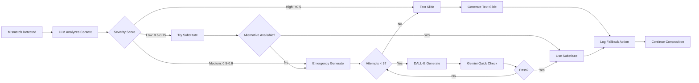

# LLM/Agent Pipeline Architecture

This diagram shows all 5 AI agents, their interactions, orchestration flow, and self-healing mechanisms.

```mermaid
flowchart TB
    subgraph ClientSide["Client-Side Processing (Next.js)"]
        UserInput[User Input:<br/>Topic, Objective, Key Points]
        PDFUpload[PDF Upload]
        URLFetch[URL Fetch]

        PDFUpload --> PDFExtraction[PDF.js Text Extraction]
        URLFetch --> URLProxy[/api/fetch-url Proxy]

        PDFExtraction --> FactExtraction[Fact Extraction Logic]
        URLProxy --> FactExtraction
        UserInput --> FactExtraction

        FactExtraction --> ExtractedFacts[Extracted Facts:<br/>• Key Concepts<br/>• Definitions<br/>• Relationships]
    end

    subgraph Orchestrator["Video Generation Orchestrator"]
        OrchestratorMain[Orchestrator Main]
        CostTracker[Cost Tracker]
        WSManager[WebSocket Manager]
        SessionDB[(Session Database)]

        OrchestratorMain --> CostTracker
        OrchestratorMain --> WSManager
        OrchestratorMain --> SessionDB
    end

    ExtractedFacts --> OrchestratorMain

    subgraph Agent2["Agent 2: Narrative Builder"]
        A2Input[Agent Input:<br/>• Topic<br/>• Learning Objective<br/>• Confirmed Facts<br/>• Target Duration: 60s<br/>• Grade Level: 6-7]

        A2Input --> A2LLM[Llama 3.1 70B<br/>System Prompt:<br/>Educational Script Writer]

        A2LLM --> A2Structure[Generate 4-Part Structure:<br/>1. Hook 10s<br/>2. Concept 15s<br/>3. Process 25s<br/>4. Conclusion 10s]

        A2Structure --> A2Validation[Validate:<br/>• Total duration ≤65s<br/>• Age-appropriate language<br/>• Covers all key concepts]

        A2Validation --> A2Output[Agent Output:<br/>• 4-segment script<br/>• Timing per segment<br/>• Cost: ~$0.01]
    end

    OrchestratorMain -->|1. Generate Script| A2Input
    A2Output --> SessionDB
    A2Output --> WSManager

    subgraph Agent3["Agent 3: Visual Pipeline"]
        A3Input[Agent Input:<br/>• Approved Script<br/>• Topic<br/>• Template Library]

        A3Input --> A3Planning[Scene Planning<br/>Llama 3.1 70B:<br/>Match segments to visuals]

        A3Planning --> A3Decision[Template vs AI Decision]

        A3Decision -->|Match Found| TemplateLib[(Template Library<br/>10 Pre-validated PSDs)]
        A3Decision -->|No Match| A3Generate

        TemplateLib --> TemplateCustom[Customize Template:<br/>• Update labels<br/>• Adjust colors<br/>• PSD layer editing]

        A3Generate[AI Generation<br/>DALL-E 3:<br/>Educational diagram prompt]

        TemplateCustom --> A3Upload[Upload to Storage]
        A3Generate --> A3Upload

        A3Upload --> A3Parallel[Parallel Generation:<br/>8-12 visuals simultaneously]

        A3Parallel --> A3Output[Agent Output:<br/>• 8-12 visual URLs<br/>• Metadata per visual<br/>• Template vs AI flag<br/>• Cost: $0.12-$0.20]
    end

    OrchestratorMain -->|2. Generate Visuals| A3Input
    A3Output --> SessionDB
    A3Output --> WSManager

    subgraph Agent4["Agent 4: Audio Pipeline"]
        A4Input[Agent Input:<br/>• Approved Script<br/>• Audio Selection Type<br/>• Voice/Music Choice]

        A4Input --> A4Type{Audio Type?}

        A4Type -->|AI Voiceover| A4TTS[ElevenLabs TTS:<br/>Per-segment generation<br/>Age-appropriate voice]
        A4Type -->|Teacher Upload| A4Upload[Process Uploaded Audio:<br/>Segment alignment]
        A4Type -->|Instrumental| A4Music[Select Background Music:<br/>Royalty-free library]
        A4Type -->|No Audio| A4Silent[Silent Video Flag]

        A4TTS --> A4Validate[Validate Audio:<br/>• Duration matches script<br/>• Quality check<br/>• Format: MP3/WAV]
        A4Upload --> A4Validate
        A4Music --> A4Validate
        A4Silent --> A4Output

        A4Validate --> A4Output[Agent Output:<br/>• 4 audio segments<br/>• Timing metadata<br/>• Cost: $0.45 TTS or $0]
    end

    OrchestratorMain -->|3. Generate Audio| A4Input
    A4Output --> SessionDB
    A4Output --> WSManager

    subgraph GeminiValidator["Gemini Vision Validator (Pre-Composition)"]
        GVInput[Validation Input:<br/>• All visual URLs<br/>• Script narration per segment<br/>• Expected concepts]

        GVInput --> GVExtract[FFmpeg Frame Extraction:<br/>30fps × 5s = 150 frames/visual]

        GVExtract --> GVAnalysis[Gemini 1.5 Pro Vision<br/>Frame-by-Frame Analysis]

        GVAnalysis --> GVCriteria[4-Criteria Validation:<br/>1. Scientific Accuracy<br/>2. Label Quality<br/>3. Age-Appropriateness<br/>4. Visual Clarity]

        GVCriteria --> GVAggregate[Aggregate Results:<br/>• Pass/fail per criterion<br/>• Confidence scores<br/>• Issues detected]

        GVAggregate --> GVDecision{All Criteria Pass?}

        GVDecision -->|Yes| GVApprove[Mark as Validated]
        GVDecision -->|No| GVFlag[Flag for Self-Healing]

        GVApprove --> GVOutput[Validation Output:<br/>• Per-visual validation JSON<br/>• Recommended action<br/>• Cost: $3.60 total]
        GVFlag --> GVOutput
    end

    OrchestratorMain -->|4. Validate Visuals| GVInput
    GVOutput --> SessionDB

    subgraph Agent5["Agent 5: Educational Compositor (Self-Healing)"]
        A5Input[Agent Input:<br/>• Validated Script<br/>• All Visuals<br/>• Gemini Validations<br/>• Audio Segments]

        A5Input --> A5Detect[Mismatch Detection:<br/>Read Gemini validation results]

        A5Detect --> A5Mismatch{Mismatches Found?}

        A5Mismatch -->|No| A5Compose
        A5Mismatch -->|Yes| A5LLM[LLM Decision Engine<br/>Llama 3.1 70B:<br/>Analyze mismatch context]

        A5LLM --> A5Strategy{Self-Healing Strategy?}

        A5Strategy -->|1. Substitute| A5Substitute[Find Best Alternative:<br/>Use different approved visual]
        A5Strategy -->|2. Emergency Generate| A5Emergency[Emergency AI Generation:<br/>DALL-E 3 with modified prompt]
        A5Strategy -->|3. Text Slide| A5TextSlide[Generate Text Slide Fallback:<br/>FFmpeg text overlay]

        A5Substitute --> A5Retry[Retry Validation]
        A5Emergency --> A5EmergencyValidation[Quick Gemini Check<br/>Max 3 attempts]
        A5EmergencyValidation --> A5EmergencyOK{Passes?}
        A5EmergencyOK -->|Yes| A5Retry
        A5EmergencyOK -->|No - Exhausted| A5TextSlide

        A5TextSlide --> A5Retry
        A5Retry --> A5Compose

        A5Compose[FFmpeg Composition:<br/>1. Build timeline<br/>2. Download all assets<br/>3. Stitch visuals<br/>4. Overlay audio<br/>5. Add transitions<br/>6. Render 1080p 30fps]

        A5Compose --> A5Output[Agent Output:<br/>• Final MP4 video<br/>• 4 separate audio files<br/>• Self-healing summary<br/>• Composition log<br/>• Cost: $0-$0.08 extra]
    end

    OrchestratorMain -->|5. Compose Video| A5Input
    A5Output --> SessionDB
    A5Output --> WSManager

    SessionDB --> FinalOutput[Final Output to User:<br/>• Video URL<br/>• Audio URLs<br/>• Cost breakdown<br/>• Logs]

    %% Styling
    classDef clientClass fill:#e3f2fd,stroke:#1976d2,stroke-width:2px
    classDef agentClass fill:#f3e5f5,stroke:#7b1fa2,stroke-width:2px
    classDef llmClass fill:#fff9c4,stroke:#f57f17,stroke-width:3px
    classDef storageClass fill:#e8f5e9,stroke:#388e3c,stroke-width:2px
    classDef validationClass fill:#ffe0b2,stroke:#e64a19,stroke-width:2px
    classDef orchestratorClass fill:#fce4ec,stroke:#c2185b,stroke-width:3px

    class ClientSide,UserInput,PDFUpload,URLFetch clientClass
    class A2Input,A2Output,A3Input,A3Output,A4Input,A4Output,A5Input,A5Output agentClass
    class A2LLM,A3Planning,A3Generate,A4TTS,A5LLM llmClass
    class SessionDB,TemplateLib storageClass
    class GeminiValidator,GVAnalysis,GVCriteria,A5Detect,A5Retry validationClass
    class Orchestrator,OrchestratorMain orchestratorClass
```

## Agent Interaction Flow

### Sequential Processing
1. **Client-Side** → Fact Extraction (Next.js)
2. **Agent 2** → Script Generation (Llama 3.1)
3. **Agent 3** → Visual Generation (Templates + DALL-E 3)
4. **Gemini Validator** → Frame-by-frame validation
5. **Agent 4** → Audio Generation (ElevenLabs or upload)
6. **Agent 5** → Self-healing composition (FFmpeg)

### Parallel Processing
- **Agent 3**: Generates 8-12 visuals simultaneously
- **Gemini Validator**: Can analyze multiple visuals concurrently
- **Agent 5**: Downloads all assets in parallel before composition

## Self-Healing Decision Logic



## Cost Breakdown by Agent

| Agent | Model/Service | Average Cost | % of Total |
|-------|--------------|--------------|------------|
| **Client-Side** | Browser Processing | $0.00 | 0% |
| **Agent 2** | Llama 3.1 70B | $0.01 | 0.2% |
| **Agent 3** | Templates + DALL-E 3 | $0.12-$0.20 | 3-4% |
| **Gemini** | Gemini 1.5 Pro Vision | $3.60 | 80% |
| **Agent 4** | ElevenLabs TTS | $0.45 | 10% |
| **Agent 5** | FFmpeg + Emergency | $0-$0.08 | 0-2% |
| **Total** | | **$4.18-$4.34** | 100% |

## Key Performance Metrics

- **Script Generation**: 3-10 seconds
- **Visual Generation**: 40-70 seconds (8-12 visuals)
- **Gemini Validation**: 90-150 seconds (all visuals)
- **Audio Generation**: 25-45 seconds (TTS)
- **Final Composition**: 60-120 seconds (with self-healing)
- **Total End-to-End**: 4-7 minutes
