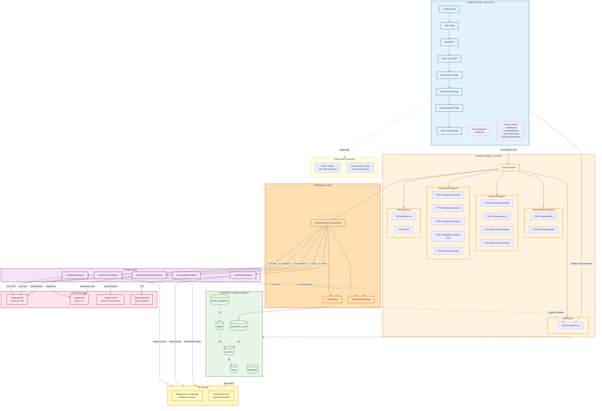
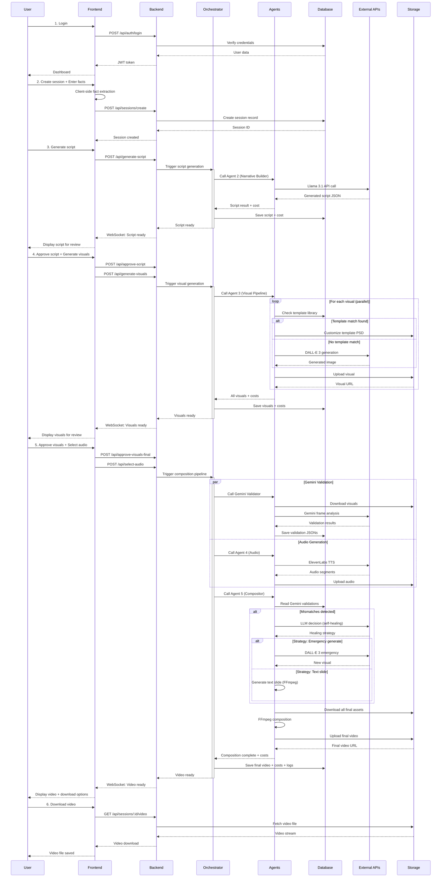
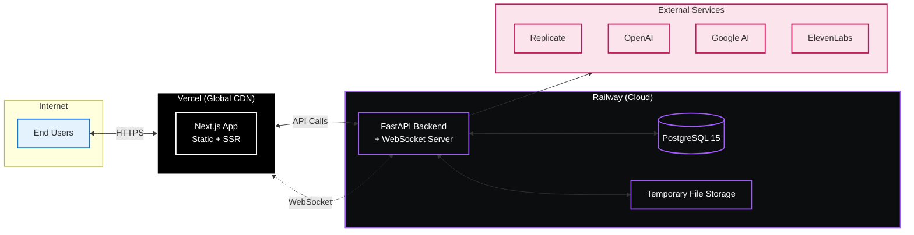

# System Architecture Overview

This diagram shows the high-level component interactions, data flow, and infrastructure of the Educational Video Generator.

## Data Flow Sequence

## Technology Stack

### Frontend
- **Framework**: Next.js 14 (App Router)
- **Language**: TypeScript
- **Styling**: Tailwind CSS
- **UI Components**: shadcn/ui
- **PDF Processing**: PDF.js
- **State Management**: React hooks (useState, useEffect)
- **WebSocket**: Native WebSocket API
- **Deployment**: Vercel

### Backend
- **Framework**: FastAPI
- **Language**: Python 3.11
- **Database ORM**: SQLAlchemy
- **Authentication**: JWT (python-jose)
- **WebSocket**: FastAPI WebSockets
- **Video Processing**: FFmpeg
- **Image Processing**: Pillow, ImageMagick
- **Deployment**: Railway

### Database
- **RDBMS**: PostgreSQL 15
- **Hosting**: Railway PostgreSQL
- **Migrations**: Alembic

### AI/ML Services
- **LLM**: Llama 3.1 70B (via Replicate)
- **Image Generation**: DALL-E 3 (OpenAI)
- **Vision Validation**: Gemini 1.5 Pro Vision (Google AI)
- **Text-to-Speech**: ElevenLabs

### Storage
- **Temporary**: Railway container local storage
- **Optional Persistent**: S3 or Cloudflare R2

### Monitoring (Optional)
- **Error Tracking**: Sentry
- **Logging**: Python logging module

## Infrastructure Costs

### Development
- **Railway**: $5 free credit → $20/month
- **Vercel**: Free tier (100GB bandwidth)
- **PostgreSQL**: Included with Railway
- **Total Infrastructure**: $0-$20/month

### Per-Video Production
- **AI Services**: $4.18-$4.34
- **Storage**: ~$0.05
- **Total per Video**: ~$4.50

### Testing Budget
- **$200 total** = ~45 test videos during sprint

## Deployment Architecture

## Security Considerations

1. **Authentication**: JWT tokens with expiration
2. **CORS**: Configured for production domains only
3. **Rate Limiting**: API rate limits per user/session
4. **Input Validation**: Pydantic models for all inputs
5. **File Upload**: Size limits, type validation
6. **Environment Variables**: Secrets stored securely
7. **Database**: Connection pooling, parameterized queries
8. **WebSocket**: Session-based authentication

## Scalability Considerations

### Current MVP (Single Server)
- Handles 1-5 concurrent video generations
- Railway auto-scaling up to allocated resources
- PostgreSQL connection pooling

### Post-MVP Scaling
- **Message Queue**: RabbitMQ or Redis for async processing
- **Worker Pools**: Distributed agent processing
- **CDN Storage**: Migrate to S3 + CloudFront
- **Database Replication**: Read replicas for sessions
- **Load Balancer**: Multiple backend instances
