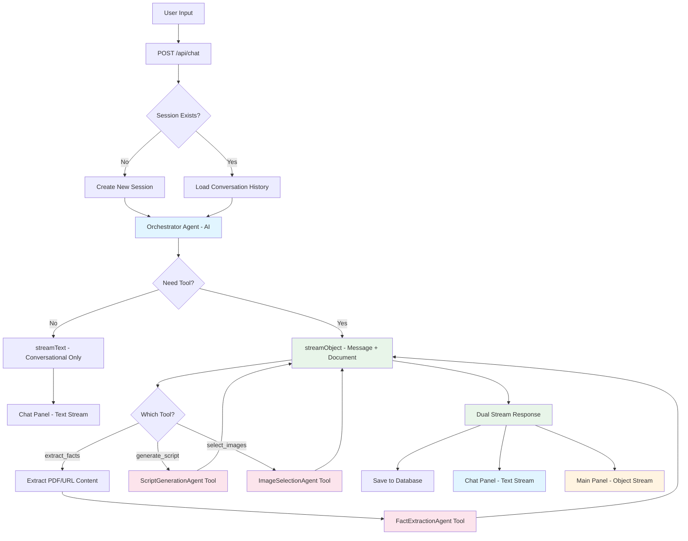
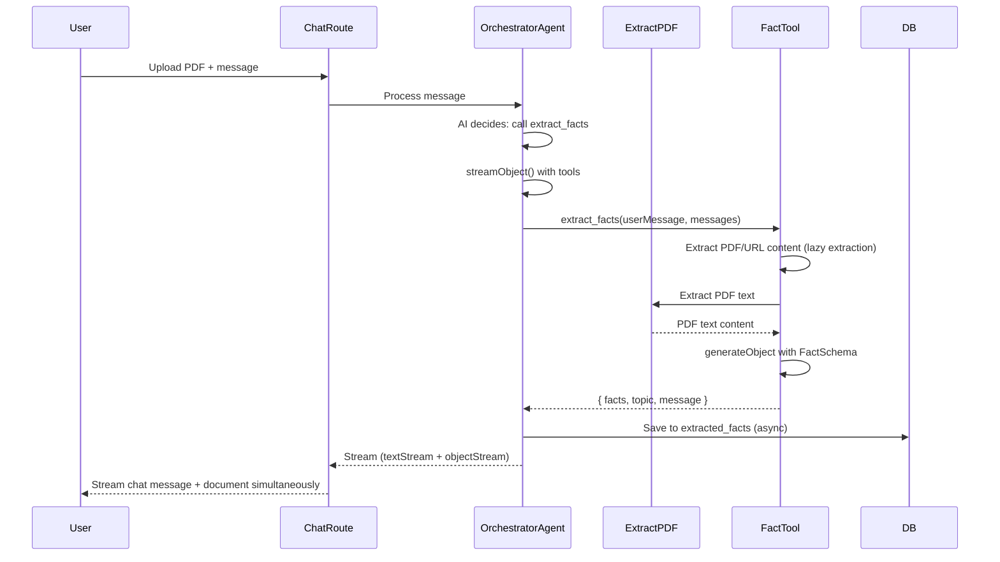
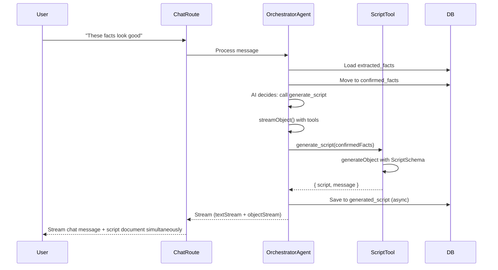
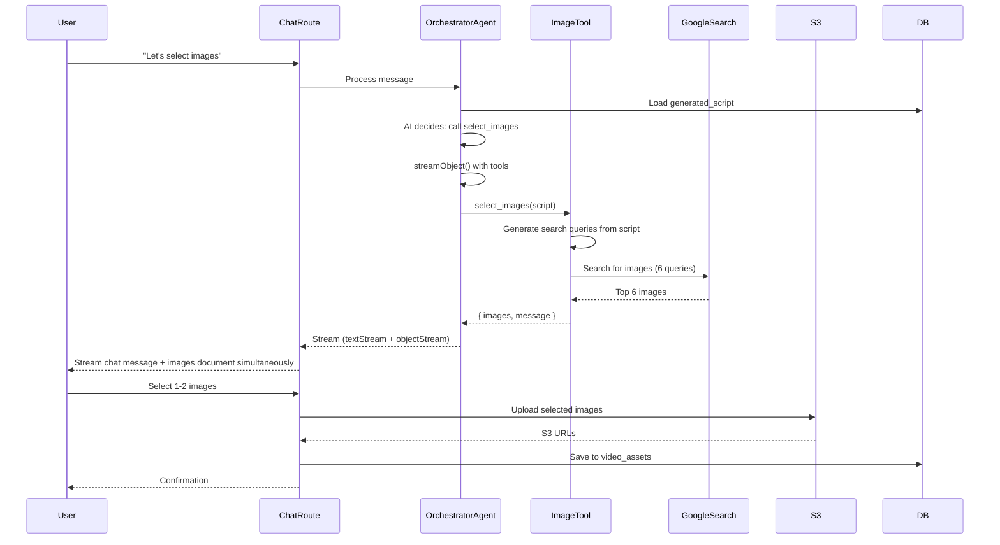

# Chat-Agent Orchestrator Architecture Documentation

## Overview

This document describes the **AI-driven Orchestrator Agent** architecture that uses **tool calling** and **streaming structured output** to coordinate specialized sub-agents for the educational video creation workflow. Unlike the previous deterministic step-based routing, this architecture uses an intelligent orchestrator that:

1. **Decides which tools to call** based on context and user intent
2. **Streams both chat messages and structured documents** simultaneously using `streamObject()`
3. **Provides real-time updates** to both the chat panel and main content area
4. **Maintains clean separation** between conversational text and structured data

The orchestrator provides concise, conversational responses while seamlessly producing structured outputs (facts, scripts, images) that appear in real-time in the main panel.

## Architecture Principles

### 1. **AI-Driven Orchestration**

- **Orchestrator Agent**: An AI agent that uses tool calling to coordinate workflow
- **Sub-Agents as Tools**: Each workflow step (facts, narration, images) is a tool the orchestrator can call
- **Intelligent Routing**: The orchestrator decides which tool to use based on conversation context
- **Unified Response**: All tools return structured outputs that the orchestrator formats for the user

### 2. **Separation of Concerns**

- **Chat Panel (Left)**: Displays only text conversation between user and AI assistant
- **Main Content Area (Right)**: Displays structured documents (facts, scripts, images) for each workflow step
- **Database**: Stores both conversation history and structured documents separately

### 3. **Tool-Based Agent Pattern**

Each sub-agent is implemented as a **tool** that:

- Receives structured input (PDF content, confirmed facts, script, etc.)
- Processes using AI with structured outputs (Zod schemas)
- Returns structured data + conversational message
- Can be called independently or in sequence by the orchestrator

### 4. **Dual Streaming Architecture**

The orchestrator uses `streamObject()` to stream both parts simultaneously:

- **Chat Message Stream**: Concise, conversational text updates in real-time
- **Document Object Stream**: Structured data (facts/script/images) updates incrementally
- **Single Response**: Both streams sent together in one data stream response
- **Real-time UX**: Users see progress as data is generated, not just at completion

## Architecture Diagram



## Database Schema

### Conversation Messages Table

Stores **text-only** conversation history:

```sql
CREATE TABLE video_conversation_message (
  id TEXT PRIMARY KEY,
  session_id TEXT NOT NULL REFERENCES video_session(id) ON DELETE CASCADE,
  role VARCHAR(20) NOT NULL, -- 'user' | 'assistant' | 'system'
  content TEXT NOT NULL, -- Text content only
  parts JSONB, -- UIMessage parts structure (for file attachments)
  metadata JSONB, -- References to structured data, workflow step
  created_at TIMESTAMP DEFAULT NOW()
);
```

**Key Points:**

- Stores only text conversation
- `metadata` contains references to structured data (not the data itself)
- Used for session resumption and chat history display

### Session Table (Updated Schema)

Store **structured documents** with separate columns for extracted and confirmed data:

```sql
-- video_session table
ALTER TABLE video_session ADD COLUMN current_step VARCHAR(50);
ALTER TABLE video_session ADD COLUMN workflow_context JSONB;

-- Facts storage (separate columns)
ALTER TABLE video_session ADD COLUMN extracted_facts JSONB; -- All extracted facts (pending review)
ALTER TABLE video_session ADD COLUMN confirmed_facts JSONB; -- Only confirmed facts (after user approval)

-- Script storage
ALTER TABLE video_session ADD COLUMN generated_script JSONB; -- Generated script (editable by user)
ALTER TABLE video_session ADD COLUMN edited_script JSONB; -- User-edited version (optional, if different from generated)

-- Existing columns
-- topic, learning_objective, status, etc.
```

**Key Points:**

- **extracted_facts**: All facts extracted from materials (pending user review)
- **confirmed_facts**: Only facts user has confirmed (used for script generation)
- **generated_script**: Script generated from confirmed facts (user can edit)
- **edited_script**: Optional column for tracking user edits (if needed for audit)
- Structured outputs stored in appropriate columns
- `workflow_context` tracks current state and step

### Video Assets Table

Stores selected images with S3 paths:

```sql
CREATE TABLE video_asset (
  id TEXT PRIMARY KEY,
  session_id TEXT NOT NULL REFERENCES video_session(id) ON DELETE CASCADE,
  asset_type VARCHAR(50) NOT NULL, -- 'image' | 'audio' | 'video'
  url TEXT, -- S3 URL or external URL
  s3_key TEXT, -- S3 key path: users/{userID}/{sessionID}/images/selected/{filename}
  metadata JSONB, -- Image metadata (source, prompt, search query, etc.)
  created_at TIMESTAMP DEFAULT NOW()
);
```

**S3 Path Structure:**

```
users/{userID}/{sessionID}/images/selected/{filename}
```

Example: `users/user_123/sess_456/images/selected/image_001.jpg`

## Orchestrator Agent

### Location

`frontend/src/server/workflows/orchestrator-agent.ts`

### Responsibilities

- Uses AI SDK's `tool` function to define sub-agents as callable tools
- Uses `streamObject()` with tool calling to stream both chat messages and structured documents
- Decides when to use tools vs. providing conversational responses
- Extracts PDF/URL content before processing
- Streams unified response with message (chat) and document (main panel) simultaneously
- Manages conversation history and structured data persistence

### System Prompt

```typescript
const orchestratorSystemPrompt = `You are an intelligent orchestrator helping a teacher create educational videos.

Your job is to:
1. Understand what the teacher needs from their message
2. Call the appropriate tool(s) to get the work done
3. Return a unified response with:
   - message: A conversational response to the teacher
   - data: The structured data from the tool (if any)
   - document: The document to display in the main panel (if any)
   - nextStep: The next workflow step (if applicable)

Available tools:
- extract_facts: Extract educational facts from learning materials (PDF, URL, or text)
  Use when: Teacher provides learning materials (PDF, URL, or text content)
  Returns: Extracted facts (pending review)
  
- generate_script: Generate educational video script from confirmed facts
  Use when: Teacher confirms facts are ready (explicit confirmation or implicit from context)
  Requires: confirmed_facts must exist in session
  Returns: Generated script (editable by user)
  
- select_images: Fetch and select images for the video script
  Use when: Script is ready and teacher wants to select images
  Requires: generated_script must exist in session
  Returns: Top 6 images from Google Programmable Search Engine for user selection

Current workflow step: {currentStep}
Current context: {workflowContext}

Be conversational and helpful. Guide the teacher through the workflow naturally.
Provide concise, short answers in the chat. When you call a tool, the structured output will automatically appear in the main panel.`;
```

### Tool Definitions

#### 1. extract_facts Tool

```typescript
extract_facts: tool({
  description: "Extract educational facts from learning materials (PDF, URL, or text). Returns facts pending user review.",
  parameters: z.object({
    userMessage: z.string().describe("Original user message for context"),
    topic: z.string().optional().describe("Detected or provided topic"),
  }),
  execute: async ({ userMessage, topic }) => {
    // Lazy extraction: Only extract PDF/URL content when this tool is called
    const extractedContent = await this.extractContent(messages, userMessage);
    const materials = extractedContent
      ? `${userMessage}\n\n--- Learning Materials ---\n${extractedContent}`
      : userMessage;

    const factAgent = new FactExtractionAgent();
    const result = await factAgent.process({
      userMessage: materials,
      conversationHistory: [],
      sessionId,
      userId,
      context: { step: "fact_extraction", topic },
    });

    return {
      facts: result.data?.facts || [],
      topic: result.data?.topic || topic,
      learningObjective: result.data?.learningObjective,
      message: result.conversationResponse,
    };
  },
}),
```

**Key Points:**

- **Lazy Extraction**: PDF/URL content is extracted only when `extract_facts` is called
- **No upfront cost**: Other tools don't wait for unnecessary extraction
- **Tool-specific**: Each tool handles its own data requirements

#### 2. generate_script Tool

```typescript
generate_script: tool({
  description: "Generate educational video script from confirmed facts. Script is editable by user after generation.",
  parameters: z.object({
    confirmedFacts: z.array(z.object({
      concept: z.string(),
      details: z.string(),
    })).describe("Confirmed facts from fact extraction step"),
    topic: z.string().optional().describe("Topic for the video"),
    learningObjective: z.string().optional().describe("Learning objective"),
  }),
  execute: async ({ confirmedFacts, topic, learningObjective }) => {
    const scriptAgent = new ScriptGenerationAgent();
    const result = await scriptAgent.process({
      userMessage: `Generate script for topic: ${topic || "educational content"}`,
      conversationHistory: [],
      sessionId: "",
      userId: "",
      context: {
        step: "script_generation",
        confirmedFacts,
        topic,
        learningObjective,
      },
    });

    return {
      script: result.data,
      message: result.conversationResponse,
    };
  },
}),
```

#### 3. select_images Tool

```typescript
select_images: tool({
  description: "Fetch top 6 images from Google Programmable Search Engine based on script content. User will select 1-2 images.",
  parameters: z.object({
    script: z.unknown().describe("The generated script to base image search on"),
    searchQueries: z.array(z.string()).optional().describe("Optional specific search queries for images"),
  }),
  execute: async ({ script, searchQueries }) => {
    const imageAgent = new ImageSelectionAgent();
    const result = await imageAgent.process({
      userMessage: "Fetch images for this script",
      conversationHistory: [],
      sessionId: "",
      userId: "",
      context: {
        step: "image_selection",
        generatedScript: script,
      },
    });

    return {
      images: result.data?.images || [],
      message: result.conversationResponse,
    };
  },
}),
```

### Unified Response Schema

The orchestrator uses **streaming structured output** via `streamObject()` to stream both chat messages and structured documents in real-time:

```typescript
const OrchestratorResponseSchema = z.object({
  message: z
    .string()
    .describe("Conversational response to user - displayed ONLY in chat panel"),
  data: z
    .unknown()
    .optional()
    .describe(
      "Structured data for database storage (facts, script, images) - NOT displayed in UI"
    ),
  document: z
    .unknown()
    .optional()
    .describe(
      "Document object for main panel display (editable facts, script, images) - displayed ONLY in main panel"
    ),
  nextStep: z
    .enum([
      "fact_extraction",
      "script_generation",
      "image_selection",
      "completed",
    ])
    .optional()
    .describe("Next workflow step"),
});
```

**Key Separation:**

- **`message`**: Pure text for chat panel - no JSON, no structured data
- **`data`**: Structured data for database persistence - not sent to frontend
- **`document`**: Formatted document for main panel - contains UI-ready structure
- **`nextStep`**: Workflow state management

**Example Response:**

When `extract_facts` tool is called:

```typescript
{
  message: "I've extracted 12 educational facts from your materials. Please review them in the main panel.",
  data: {
    facts: [...],  // Raw facts for database
    topic: "Photosynthesis",
    learningObjective: "Understand the process of photosynthesis"
  },
  document: {
    type: "facts",
    facts: [...],  // Same facts, but formatted for UI display
    editable: true
  },
  nextStep: "fact_extraction"
}
```

The chat route then:

1. **Streams `message`** to chat panel (text stream) - real-time updates
2. **Streams `document`** to main panel (object stream) - real-time updates
3. **Saves `data`** to database (`extracted_facts` column) - persisted for session resumption

## Sub-Agents (Tools)

### 1. FactExtractionAgent

**Location**: `frontend/src/server/workflows/agents/fact-extraction-agent.ts`

**Input**:

- Learning materials (PDF text, URL content, or direct text)
- User message for context

**Process**:

1. Uses `generateObject` with `FactExtractionOutputSchema`
2. Extracts 5-15 educational facts
3. Detects topic and learning objective

**Output Schema**:

```typescript
const FactExtractionOutputSchema = z.object({
  facts: z.array(FactSchema).min(5).max(15),
  topic: z.string().optional(),
  learningObjective: z.string().optional(),
});
```

**Storage**:

- **extracted_facts**: All extracted facts saved to `video_sessions.extracted_facts`
- **confirmed_facts**: Only saved when user explicitly confirms (moved from `extracted_facts`)

**UI**:

- **Chat**: "I've extracted X facts from your materials. Please review them in the main panel."
- **Main Panel**: Displays `FactExtractionPanel` with editable facts cards

### 2. ScriptGenerationAgent

**Location**: `frontend/src/server/workflows/agents/script-generation-agent.ts`

**Input**:

- **confirmed_facts**: Only confirmed facts from database (not extracted_facts)
- Topic and learning objective

**Process**:

1. Loads `confirmed_facts` from `video_sessions.confirmed_facts`
2. Uses `generateObject` with `ScriptOutputSchema`
3. Generates 4-part educational script (Introduction, Main Content, Examples, Conclusion)

**Output Schema**:

```typescript
const ScriptOutputSchema = z.object({
  segments: z.array(
    z.object({
      segmentNumber: z.number(),
      segmentType: z.enum([
        "introduction",
        "main_content",
        "examples",
        "conclusion",
      ]),
      startTime: z.number(),
      endTime: z.number(),
      narration: z.string(),
      visualGuidance: z.string(),
      keyConcepts: z.array(z.string()),
    })
  ),
  totalDuration: z.number(),
});
```

**Storage**:

- **generated_script**: Saved to `video_sessions.generated_script` after generation
- **edited_script**: Optional column for tracking user edits (if user modifies the script)

**User Editing**:

- User can edit narration and visual guidance in `ScriptReviewPanel`
- Edits are saved back to `generated_script` (overwrites original)
- No separate `edited_script` column needed unless audit trail is required

**UI**:

- **Chat**: "I've generated your script based on the confirmed facts. You can review and edit it in the main panel."
- **Main Panel**: Displays `ScriptReviewPanel` with editable script segments

### 3. ImageSelectionAgent

**Location**: `frontend/src/server/workflows/agents/image-selection-agent.ts`

**Input**:

- Generated script (for generating search queries)
- Optional: Specific search queries

**Process**:

1. Generates search queries from script segments
2. Fetches top 6 images from **Google Programmable Search Engine** API
3. Returns image URLs and metadata for user selection

**Google Programmable Search Engine Integration**:

```typescript
async function fetchImagesFromGoogle(
  searchQuery: string,
  apiKey: string,
  searchEngineId: string,
  numResults: number = 6
): Promise<
  Array<{
    url: string;
    title: string;
    thumbnail: string;
    source: string;
  }>
> {
  const response = await fetch(
    `https://www.googleapis.com/customsearch/v1?` +
      `key=${apiKey}&` +
      `cx=${searchEngineId}&` +
      `q=${encodeURIComponent(searchQuery)}&` +
      `searchType=image&` +
      `num=${numResults}&` +
      `safe=active&` +
      `imgSize=large&` +
      `imgType=photo`
  );

  const data = await response.json();
  return (
    data.items?.map((item: any) => ({
      url: item.link,
      title: item.title,
      thumbnail: item.image?.thumbnailLink,
      source: item.displayLink,
    })) || []
  );
}
```

**Output Schema**:

```typescript
const ImageSelectionOutputSchema = z.object({
  availableImages: z
    .array(
      z.object({
        id: z.string(),
        url: z.string(),
        thumbnail: z.string(),
        title: z.string(),
        source: z.string(),
        searchQuery: z.string(),
      })
    )
    .length(6)
    .describe("Top 6 images from Google search"),
  message: z.string().describe("Message to user about image selection"),
});
```

**Storage**:

- Selected images are uploaded to S3 at: `users/{userID}/{sessionID}/images/selected/{filename}`
- Metadata saved to `video_assets` table:
  - `asset_type`: "image"
  - `url`: S3 URL
  - `s3_key`: Full S3 key path
  - `metadata`: { source, searchQuery, originalUrl, etc. }

**S3 Upload Process**:

```typescript
async function uploadSelectedImage(
  imageUrl: string,
  userId: string,
  sessionId: string,
  filename: string
): Promise<{ s3Key: string; s3Url: string }> {
  // 1. Fetch image from Google search result
  const imageResponse = await fetch(imageUrl);
  const imageBuffer = await imageResponse.arrayBuffer();

  // 2. Upload to S3
  const s3Key = `users/${userId}/${sessionId}/images/selected/${filename}`;
  await s3Client.putObject({
    Bucket: process.env.S3_BUCKET_NAME,
    Key: s3Key,
    Body: Buffer.from(imageBuffer),
    ContentType: "image/jpeg",
  });

  // 3. Generate presigned URL
  const s3Url = await getPresignedUrl(s3Key);

  return { s3Key, s3Url };
}
```

**UI**:

- **Chat**: "I've found 6 images based on your script. Please select 1-2 images in the main panel."
- **Main Panel**: Displays `ImageSelectionPanel` with image grid (6 images) and selection interface

## Data Flow

### 1. User Submits Learning Materials



### 2. User Confirms Facts



### 3. User Selects Images



## Implementation Details

### Orchestrator Agent Process Method

The orchestrator uses `streamObject()` to stream both chat messages and structured documents in real-time:

```typescript
async process(
  sessionId: string,
  userId: string,
  userMessage: string,
  messages: UIMessage[],
): Promise<StreamableValue<OrchestratorResponse>> {
  // 1. Load current session state
  const session = await this.loadSession(sessionId);

  // 2. Build system prompt with context
  const systemPrompt = this.buildSystemPrompt(session);

  // 3. Get tools with proper session context
  // Note: Tools handle their own content extraction (extract_facts extracts PDF/URL)
  const tools = this.getTools(sessionId, userId);

  // 4. Use streamObject to stream both message and document
  // This streams the structured output in real-time, allowing both
  // the chat message and document to update as they're generated
  // Content extraction happens inside the extract_facts tool when it's called
  const result = await streamObject({
    model: openai("gpt-4o-mini"),
    schema: OrchestratorResponseSchema,
    system: systemPrompt,
    tools: tools,
    messages: [
      ...convertToModelMessages(messages),
      {
        role: "user",
        content: userMessage,
      },
    ],
  });

  // 5. Process the stream to save data to database
  // The stream provides incremental updates, but we also save the final result
  const streamWithSaving = pipeDataStreamValues(result.objectStream, async (value) => {
    // Save structured data incrementally or on final value
    if (value && typeof value === 'object' && 'data' in value) {
      await this.saveStructuredData(sessionId, value.data, value);
    }
    return value;
  });

  // 6. Return streamable value
  // Frontend receives both textStream (chat) and objectStream (document)
  return streamWithSaving;
}
```

**Key Points:**

- **`streamObject()`**: Streams structured data incrementally as it's generated
- **Real-time Updates**: Both chat message and document update in real-time
- **Dual Stream**: `result.textStream` for chat, `result.objectStream` for document
- **Database Saving**: Can save incrementally or wait for final value

### Chat Route Handling

The chat route receives a streamable value and streams both chat message and document:

```typescript
// In POST /api/chat route.ts
const orchestratorStream = await orchestratorAgent.process(
  sessionId,
  session.user.id,
  userContent,
  messages
);

// Stream both chat message and document together
// streamObject() provides both textStream and objectStream
// We use toDataStreamResponse() to send both parts in one response
return toDataStreamResponse({
  objectStream: orchestratorStream,
  // The text stream is embedded in the object stream
  // Frontend can extract both parts from the data stream
});
```

**Decision Logic: When to use `streamText` vs `streamObject`:**

The orchestrator agent decides internally whether to call tools. The route always calls the orchestrator, which:

1. **Uses `streamObject()`** when tools are needed (extract facts, generate script, select images)

   - Returns both chat message stream and document object stream
   - Frontend receives dual stream via `toDataStreamResponse()`

2. **Uses `streamText()` internally** for simple conversational responses (no tools needed)
   - Returns only chat message stream
   - Frontend receives text stream via `toUIMessageStreamResponse()`

The orchestrator's AI decides based on:

- User message content and intent
- Current workflow step and session state
- Whether files/materials are provided
- Whether structured output is needed

**Note:** The route doesn't need to decide - the orchestrator handles this intelligently.

**Frontend receives:**

- **Chat**: Streamed text message (from `textStream` in data stream)
- **Main Panel**: Streamed structured document (from `objectStream` in data stream)
- **Real-time Updates**: Both parts update incrementally as they're generated

**Frontend Handling:**

```typescript
// Frontend extracts both streams from the data stream response
const { objectStream, textStream } = await response.body;

// Process text stream for chat panel
for await (const chunk of textStream) {
  updateChatPanel(chunk);
}

// Process object stream for main panel
for await (const chunk of objectStream) {
  updateMainPanel(chunk.document);
}
```

This ensures:

- Chat never shows JSON or structured data (only text stream)
- Main panel receives clean, editable documents (only object stream)
- Real-time updates for both panels as data is generated
- Database stores raw structured data separately for persistence

### Content Extraction

PDF and URL content extraction is **lazy** - it only happens when the `extract_facts` tool is called, not at the orchestrator level. This is more efficient because:

- **No unnecessary extraction**: Content is only extracted when facts are actually needed
- **Faster responses**: Other tools (generate_script, select_images) don't wait for extraction
- **Better separation**: Each tool handles its own data requirements

**Implementation in extract_facts tool:**

```typescript
extract_facts: tool({
  // ... tool definition ...
  execute: async ({ userMessage, topic }) => {
    // Extract PDF/URL content ONLY when this tool is called
    const extractedContent = await this.extractContent(messages, userMessage);

    // Combine extracted content with user message
    const materials = extractedContent
      ? `${userMessage}\n\n--- Learning Materials ---\n${extractedContent}`
      : userMessage;

    // Process with fact extraction agent
    const result = await this.factAgent.process({
      userMessage: materials,
      // ... rest of processing
    });

    return { /* ... */ };
  },
}),

// Helper method in orchestrator (only used by extract_facts tool)
private async extractContent(
  messages: UIMessage[],
  userMessage: string,
): Promise<string> {
  const lastUserMessage = messages.filter((m) => m.role === "user").pop();
  const extractedContent: string[] = [];

  // Extract PDF content
  if (lastUserMessage?.parts) {
    const fileParts = lastUserMessage.parts.filter(
      (part): part is FileUIPart => part.type === "file"
    );

    for (const filePart of fileParts) {
      if (filePart.mediaType === "application/pdf" ||
          filePart.filename?.toLowerCase().endsWith(".pdf")) {
        const pdfText = await extractTextFromPDF(filePart.url);
        extractedContent.push(`--- PDF Content ---\n${pdfText}`);
      }
    }
  }

  // Extract URL content
  const detectedURLs = detectURLs(userMessage);
  for (const url of detectedURLs) {
    const urlText = await extractTextFromURL(url);
    extractedContent.push(`--- URL Content (${url}) ---\n${urlText}`);
  }

  return extractedContent.join("\n\n");
}
```

## Benefits

### 1. **Clean Separation of Concerns**

- **Streaming Structured Output**: Orchestrator uses `streamObject()` to stream both chat messages and documents simultaneously
- **Chat Panel**: Only receives conversational text stream (no JSON, no structured data)
- **Main Panel**: Receives clean, editable document object stream
- **Database**: Stores raw structured data separately from UI concerns
- **Real-time Updates**: Both panels update incrementally as data is generated

### 2. **Intelligent Decision Making**

- AI orchestrator can reason about which tool to use
- Can handle edge cases and ambiguous user input
- Can ask clarifying questions before calling tools

### 3. **Flexible Workflow**

- Not locked into rigid step-by-step flow
- Can skip steps if not needed
- Can combine multiple tools in one turn

### 4. **Better User Experience**

- More natural conversation flow
- Orchestrator can provide context-aware responses
- Can handle corrections and changes mid-workflow
- Chat stays clean and conversational (no JSON blocks)
- **Real-time feedback**: Users see updates as they happen, not just at the end
- **Progressive rendering**: Documents appear incrementally, improving perceived performance

### 5. **Extensibility**

- Add new tools without changing orchestrator logic
- Tools are independent and testable
- Easy to add new workflow steps

### 6. **Type Safety**

- Zod schemas for all structured outputs
- TypeScript types generated from schemas
- Compile-time error checking
- Structured output ensures type-safe separation

## Trade-offs

### 1. **Cost**

- Orchestrator makes AI decision (1 LLM call)
- Each tool may make additional LLM calls
- More expensive than deterministic routing

### 2. **Latency**

- Multiple sequential LLM calls can add delay
- Tool execution time varies
- May need to optimize for speed

### 3. **Reliability**

- AI decisions can be unpredictable
- May need fallback to deterministic routing
- Requires good error handling

### 4. **Debugging**

- More complex to trace execution flow
- Tool calls may not be obvious
- Need good logging and monitoring

## File Structure

```
frontend/src/
├── server/
│   ├── workflows/
│   │   ├── orchestrator-agent.ts      # AI-driven orchestrator with tools
│   │   ├── agents/
│   │   │   ├── base-agent.ts           # Base agent interface
│   │   │   ├── fact-extraction-agent.ts
│   │   │   ├── script-generation-agent.ts
│   │   │   └── image-selection-agent.ts
│   │   ├── schemas/
│   │   │   ├── fact-extraction-schema.ts
│   │   │   ├── script-generation-schema.ts
│   │   │   └── image-selection-schema.ts
│   │   └── utils/
│   │       ├── extractPDF.ts           # Server-side PDF extraction
│   │       ├── extractURL.ts           # Server-side URL extraction
│   │       └── google-search.ts        # Google Programmable Search Engine integration
│   └── db/
│       └── video-generation/
│           └── schema.ts               # Database schema
├── app/
│   └── api/
│       └── chat/
│           └── route.ts                # Chat API endpoint
└── types/
    └── workflow.ts                      # Workflow types
```

## Environment Variables

```env
# OpenAI
OPENAI_API_KEY=sk-...

# Google Programmable Search Engine
GOOGLE_SEARCH_API_KEY=...
GOOGLE_SEARCH_ENGINE_ID=...

# AWS S3
S3_BUCKET_NAME=...
AWS_ACCESS_KEY_ID=...
AWS_SECRET_ACCESS_KEY=...
AWS_REGION=...
```

## Future Enhancements

1. **Hybrid Approach**: Use deterministic routing for simple cases, AI orchestrator for complex decisions

2. **Tool Chaining**: Allow tools to call other tools (e.g., image tool can call script tool if script is missing)

3. **Streaming Tools**: ✅ Implemented - Uses `streamObject()` to stream both chat and documents in real-time

4. **Cost Optimization**: Cache tool results, batch operations, use cheaper models where possible

5. **Error Recovery**: Better error handling and automatic retry logic

6. **Analytics**: Track tool usage, success rates, and costs per workflow step
